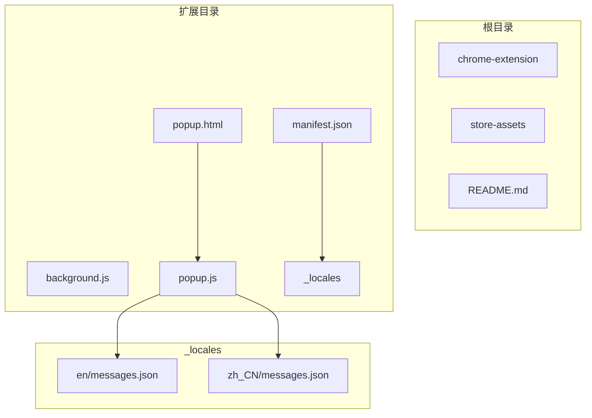
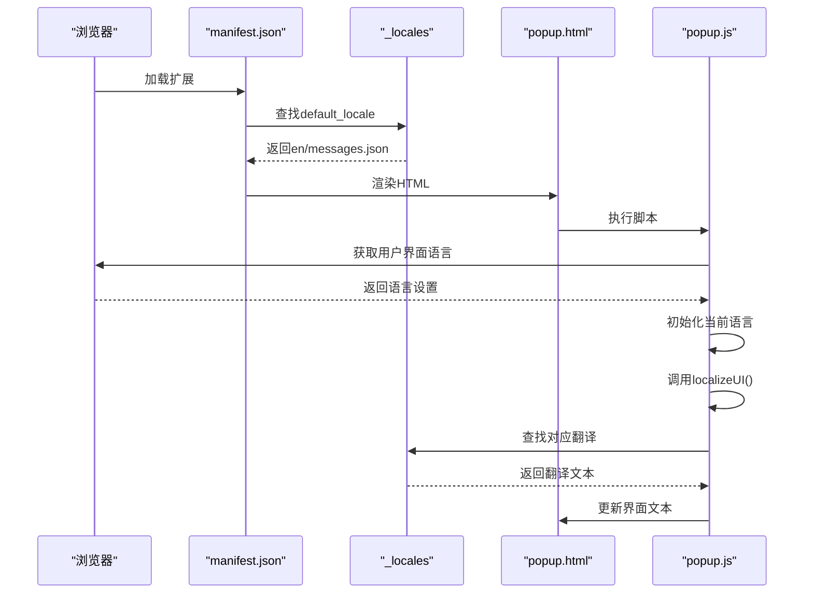
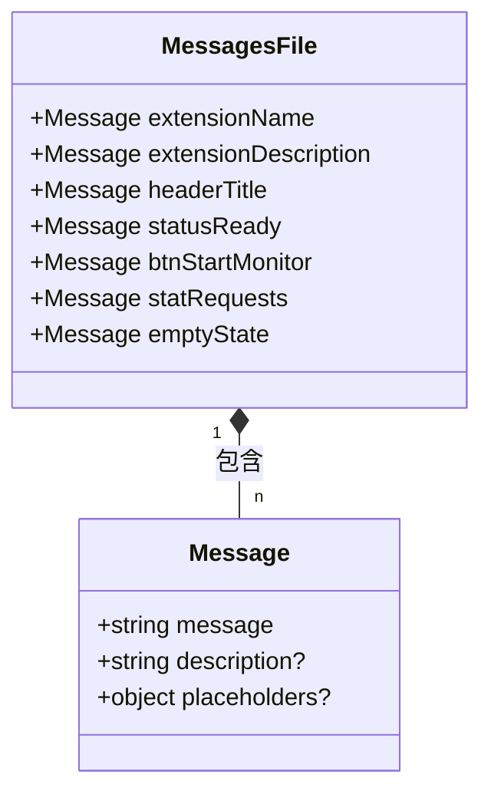
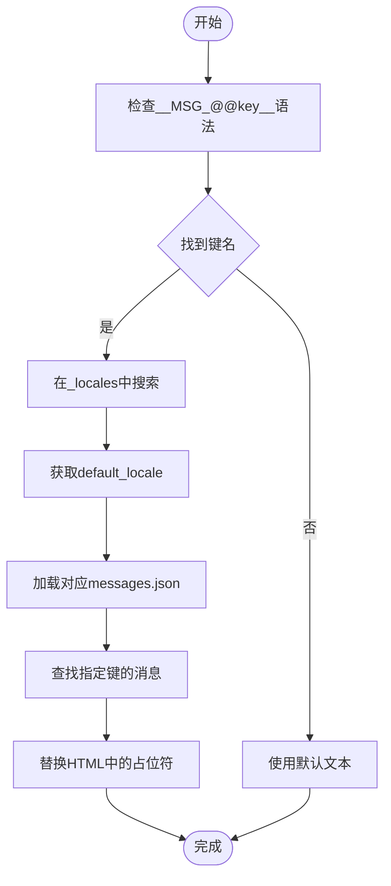
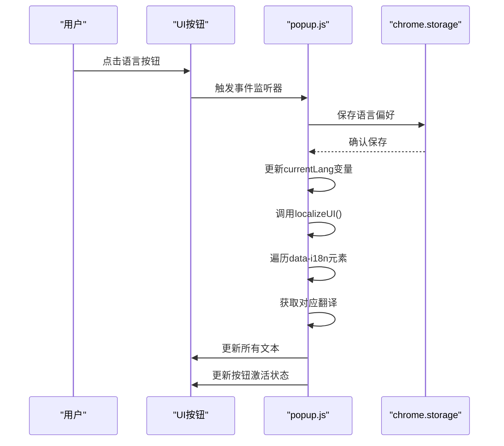
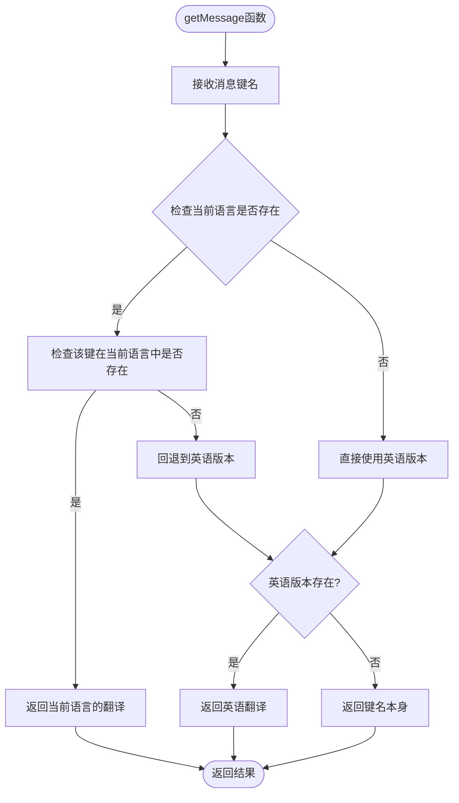
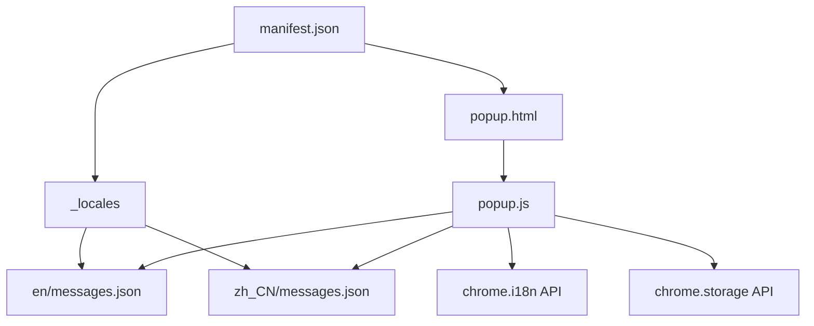

# 多语言支持

<cite>
**本文档引用的文件**
- [manifest.json](file://chrome-extension/manifest.json)
- [popup.html](file://chrome-extension/popup.html)
- [messages.json](file://chrome-extension/_locales/en/messages.json)
- [messages.json](file://chrome-extension/_locales/zh_CN/messages.json)
- [popup.js](file://chrome-extension/popup.js)
</cite>

## 目录
1. [简介](#简介)
2. [项目结构](#项目结构)
3. [核心组件](#核心组件)
4. [架构概述](#架构概述)
5. [详细组件分析](#详细组件分析)
6. [依赖分析](#依赖分析)
7. [性能考虑](#性能考虑)
8. [故障排除指南](#故障排除指南)
9. [结论](#结论)

## 简介
本项目通过Chrome扩展的_i18n系统实现了中英文双语界面支持。系统采用双重国际化机制：一方面利用Chrome原生的_i18n框架实现静态文本的自动翻译，另一方面在JavaScript代码中实现动态语言切换功能。这种设计既保证了扩展名称、描述等元数据的正确显示，又允许用户在弹出界面内实时切换语言。

## 项目结构

**Diagram sources**
- [manifest.json](file://chrome-extension/manifest.json)
- [_locales/en/messages.json](file://chrome-extension/_locales/en/messages.json)
- [_locales/zh_CN/messages.json](file://chrome-extension/_locales/zh_CN/messages.json)

**Section sources**
- [manifest.json](file://chrome-extension/manifest.json)
- [popup.html](file://chrome-extension/popup.html)

## 核心组件

项目的核心国际化组件包括：`manifest.json`中的默认语言配置、`_locales`目录下的多语言消息文件、以及`popup.js`中的语言切换逻辑。这些组件协同工作，确保用户界面能够根据用户的语言偏好正确显示相应内容。

**Section sources**
- [manifest.json](file://chrome-extension/manifest.json)
- [popup.js](file://chrome-extension/popup.js)
- [_locales/en/messages.json](file://chrome-extension/_locales/en/messages.json)

## 架构概述

**Diagram sources**
- [manifest.json](file://chrome-extension/manifest.json)
- [popup.js](file://chrome-extension/popup.js)
- [_locales/en/messages.json](file://chrome-extension/_locales/en/messages.json)

## 详细组件分析

### 国际化配置分析

#### messages.json文件结构

**Diagram sources**
- [_locales/en/messages.json](file://chrome-extension/_locales/en/messages.json)
- [_locales/zh_CN/messages.json](file://chrome-extension/_locales/zh_CN/messages.json)

#### 消息引用机制

**Diagram sources**
- [manifest.json](file://chrome-extension/manifest.json)
- [popup.html](file://chrome-extension/popup.html)

**Section sources**
- [manifest.json](file://chrome-extension/manifest.json#L1-L32)
- [popup.html](file://chrome-extension/popup.html#L1-L236)

### 动态语言切换分析

#### 语言切换流程

**Diagram sources**
- [popup.js](file://chrome-extension/popup.js#L100-L150)
- [popup.html](file://chrome-extension/popup.html#L20-L25)

#### 文本本地化函数

**Diagram sources**
- [popup.js](file://chrome-extension/popup.js#L43-L49)

**Section sources**
- [popup.js](file://chrome-extension/popup.js#L43-L49)

## 依赖分析

**Diagram sources**
- [manifest.json](file://chrome-extension/manifest.json)
- [popup.js](file://chrome-extension/popup.js)
- [_locales/en/messages.json](file://chrome-extension/_locales/en/messages.json)
- [_locales/zh_CN/messages.json](file://chrome-extension/_locales/zh_CN/messages.json)

**Section sources**
- [manifest.json](file://chrome-extension/manifest.json)
- [popup.js](file://chrome-extension/popup.js)

## 性能考虑
系统的国际化实现对性能影响较小。消息文件在扩展安装时即被加载，不会产生额外的网络请求。语言切换操作仅涉及DOM文本更新，不重新加载页面或组件。对于大型翻译文件，建议按功能模块拆分，避免单个messages.json文件过大。

## 故障排除指南
当遇到国际化问题时，首先检查控制台是否有相关警告信息。确认`manifest.json`中的`default_locale`配置正确，并验证`_locales`目录结构是否符合规范。使用`chrome.i18n.getMessage("@@extensionName")`在开发者工具中测试消息加载情况。确保所有翻译键名在各语言文件中保持一致，避免遗漏导致回退到默认文本。

**Section sources**
- [manifest.json](file://chrome-extension/manifest.json)
- [popup.js](file://chrome-extension/popup.js)

## 结论
该项目成功实现了完整的双语支持，结合了Chrome原生_i18n系统和自定义语言切换功能。通过合理的文件组织和清晰的代码结构，确保了多语言界面的稳定性和可维护性。未来扩展更多语言时，只需添加相应的_locales子目录和messages.json文件即可。