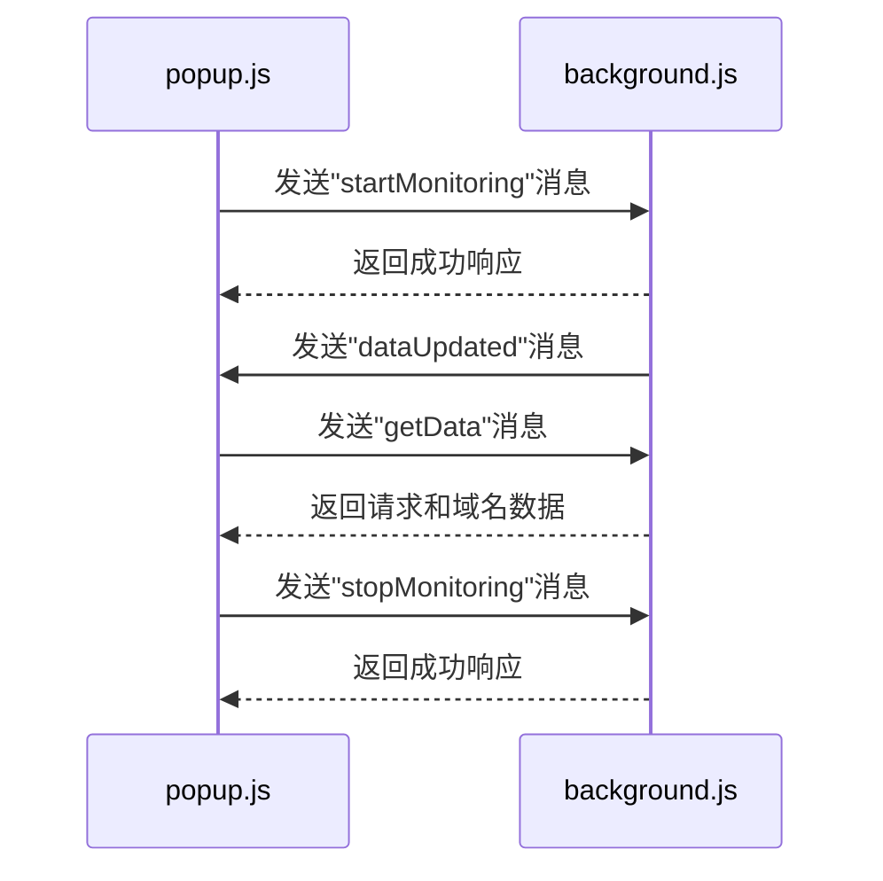
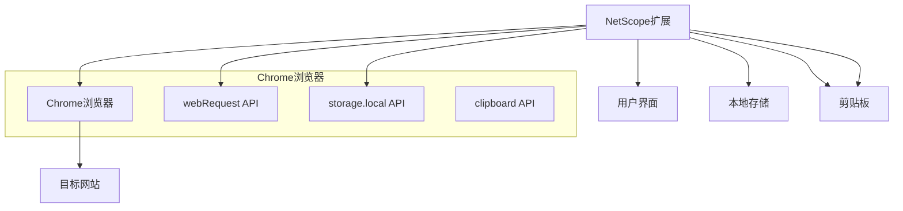
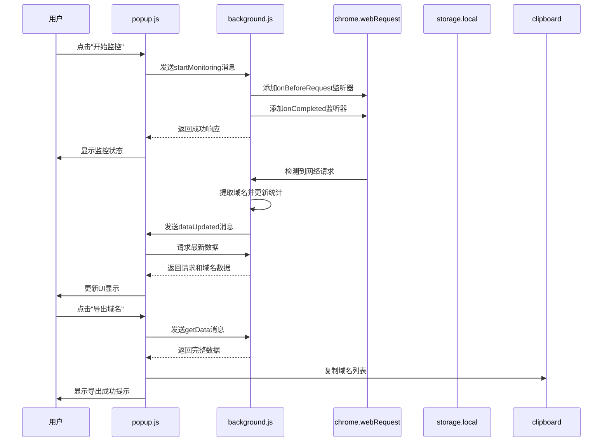

# 技术架构分析

<cite>
**本文档引用的文件**
- [background.js](file://chrome-extension/background.js) - *在最近提交中更新，支持全局监控*
- [popup.js](file://chrome-extension/popup.js) - *在最近提交中更新，适配全局监控功能*
- [manifest.json](file://chrome-extension/manifest.json) - *在最近提交中更新，host_permissions升级为<all_urls>*
- [popup.html](file://chrome-extension/popup.html)
- [messages.json](file://chrome-extension/_locales/en/messages.json)
- [messages.json](file://chrome-extension/_locales/zh_CN/messages.json)
</cite>

## 目录
1. [系统概述](#系统概述)
2. [三层架构模式](#三层架构模式)
3. [组件通信机制](#组件通信机制)
4. [轻量级架构优势与局限](#轻量级架构优势与局限)
5. [系统上下文图](#系统上下文图)
6. [组件交互图](#组件交互图)
7. [API集成方式](#api集成方式)
8. [安全性设计](#安全性设计)
9. [可扩展性评估](#可扩展性评估)
10. [结论](#结论)

## 系统概述
white_list_count_tool是一款基于Chrome扩展技术的网络请求监控工具，采用无后端、无外部依赖的轻量级架构设计。该工具通过Chrome浏览器提供的Web API实现对网络请求的实时监控和域名统计功能，为开发者提供了一种简单高效的网络分析解决方案。

**Section sources**
- [README.md](file://README.md#L0-L196)

## 三层架构模式
white_list_count_tool采用了清晰的三层架构模式，将系统划分为后台服务层、前端界面层和配置管理层三个主要组成部分。

### 后台服务层（background.js）
作为系统的后台服务层，background.js负责监听和处理所有网络请求。该组件在浏览器后台持续运行，通过chrome.webRequest API捕获所有标签页的网络活动，包括资源加载和API调用。它维护着请求数据的内存存储，并在检测到新请求时进行域名提取和统计更新。与之前版本仅监控指定标签页不同，最新版本已升级为全局监控模式，能够捕获浏览器中所有标签页的网络请求。

**Section sources**
- [background.js](file://chrome-extension/background.js#L0-L109)

### 前端界面层（popup.js）
作为系统的前端界面层，popup.js负责处理用户交互和界面展示。该组件通过事件监听器响应用户的操作指令，如开始监控、停止监控、导出数据等。同时，它还负责从后台服务获取最新的监控数据，并以直观的方式在弹出窗口中展示统计结果和域名列表。在最新版本中，前端已适配全局监控功能，不再需要传递特定标签页ID。

**Section sources**
- [popup.js](file://chrome-extension/popup.js#L0-L255)

### 配置管理层（manifest.json）
作为系统的配置管理层，manifest.json定义了扩展的基本信息、权限需求和入口点。该文件遵循Chrome扩展Manifest V3规范，明确声明了扩展所需的webRequest、storage和activeTab等权限，并指定了background.js作为后台服务工作线程，popup.html作为默认弹出页面。在最新版本中，host_permissions已从特定权限升级为<all_urls>，以支持全局网络请求监控。

**Section sources**
- [manifest.json](file://chrome-extension/manifest.json#L0-L32)

## 组件通信机制
系统各组件之间通过chrome.runtime.sendMessage API进行异步通信，形成了一个高效的消息传递体系。

**Diagram sources**
- [background.js](file://chrome-extension/background.js#L0-L109)
- [popup.js](file://chrome-extension/popup.js#L0-L255)

**Section sources**
- [background.js](file://chrome-extension/background.js#L0-L109)
- [popup.js](file://chrome-extension/popup.js#L0-L255)

## 轻量级架构优势与局限
white_list_count_tool的无后端、无外部依赖架构设计带来了显著的优势，同时也存在一定的局限性。

### 架构优势
1. **部署简便**：无需服务器基础设施，用户只需安装扩展即可使用
2. **隐私保护**：所有数据处理均在本地完成，不涉及数据上传
3. **即时可用**：安装后立即生效，无需额外配置
4. **跨平台兼容**：基于Chrome扩展标准，可在所有支持Chrome的平台上运行
5. **全局监控**：最新版本支持监控所有标签页的网络请求，提供更全面的分析能力

### 架构局限
1. **数据持久性差**：数据仅存储在内存中，浏览器重启后丢失
2. **存储容量有限**：受限于浏览器内存，无法处理大规模数据集
3. **设备隔离**：数据无法在不同设备间同步
4. **功能受限**：无法实现需要服务器端计算的复杂分析功能

**Section sources**
- [background.js](file://chrome-extension/background.js#L0-L109)
- [popup.js](file://chrome-extension/popup.js#L0-L255)

## 系统上下文图
以下图表展示了white_list_count_tool与外部环境的交互关系：

**Diagram sources**
- [background.js](file://chrome-extension/background.js#L0-L109)
- [popup.js](file://chrome-extension/popup.js#L0-L255)
- [manifest.json](file://chrome-extension/manifest.json#L0-L32)

## 组件交互图
以下序列图详细描述了系统核心功能的执行流程：

**Diagram sources**
- [background.js](file://chrome-extension/background.js#L0-L109)
- [popup.js](file://chrome-extension/popup.js#L0-L255)

## API集成方式
系统充分利用了Chrome扩展平台提供的多种API来实现核心功能。

### chrome.webRequest API
用于监听和捕获网络请求，是系统数据采集的基础。通过onBeforeRequest和onCompleted事件监听器，系统能够获取请求的URL、类型、方法等详细信息。在最新版本中，监听器配置已更新为{ urls: ["<all_urls>"] }，以支持全局网络请求监控。

**Section sources**
- [background.js](file://chrome-extension/background.js#L0-L109)

### storage.local API
用于存储用户偏好设置，如语言选择。该API提供了简单的键值对存储功能，确保用户设置在会话间保持一致。

**Section sources**
- [popup.js](file://chrome-extension/popup.js#L0-L255)

### clipboard API
通过document.execCommand('copy')实现域名列表的复制功能，使用户能够方便地将数据粘贴到其他应用程序中。

**Section sources**
- [popup.js](file://chrome-extension/popup.js#L0-L255)

## 安全性设计
系统在安全性方面遵循最小权限原则，确保只请求必要的权限。

### 最小权限原则
manifest.json中声明的权限经过精心设计：
- webRequest：仅用于监控网络请求
- storage：仅用于保存用户语言偏好
- activeTab：用于获取当前标签页信息
- <all_urls>：允许监控所有网站的请求（在用户主动启动监控时）

**Section sources**
- [manifest.json](file://chrome-extension/manifest.json#L0-L32)

### 数据本地处理
所有数据处理均在用户本地完成，不涉及任何数据上传或远程存储，最大程度保护用户隐私。

**Section sources**
- [background.js](file://chrome-extension/background.js#L0-L109)
- [popup.js](file://chrome-extension/popup.js#L0-L255)

## 可扩展性评估
尽管当前架构已满足基本需求，但仍存在多个潜在的增强方向。

### 持久化存储
引入IndexedDB替代内存存储，可实现数据的长期保存和历史记录查询功能。

### 多设备同步
集成Chrome Sync API，使用户能够在不同设备间同步监控数据和设置。

### 高级分析功能
增加请求过滤、性能分析、安全检测等高级功能，提升工具的专业价值。

### 云服务集成
提供可选的云存储服务，允许用户备份重要数据并进行跨平台访问。

**Section sources**
- [background.js](file://chrome-extension/background.js#L0-L109)
- [popup.js](file://chrome-extension/popup.js#L0-L255)

## 结论
white_list_count_tool通过合理的三层架构设计和Chrome扩展技术，成功实现了一个轻量级、高隐私性的网络请求监控工具。其无后端架构降低了部署复杂度，而丰富的API集成则确保了功能完整性。最新版本通过升级为全局监控模式，进一步增强了工具的实用性。未来可通过引入持久化存储和多设备同步等功能进一步提升用户体验。