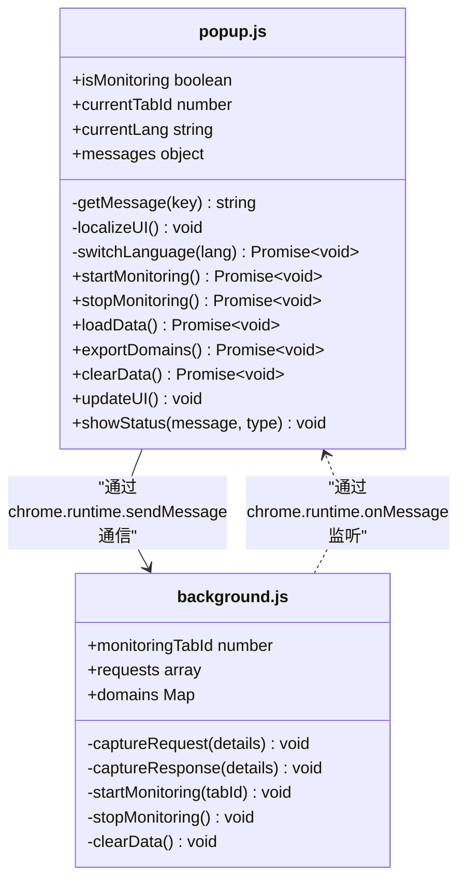
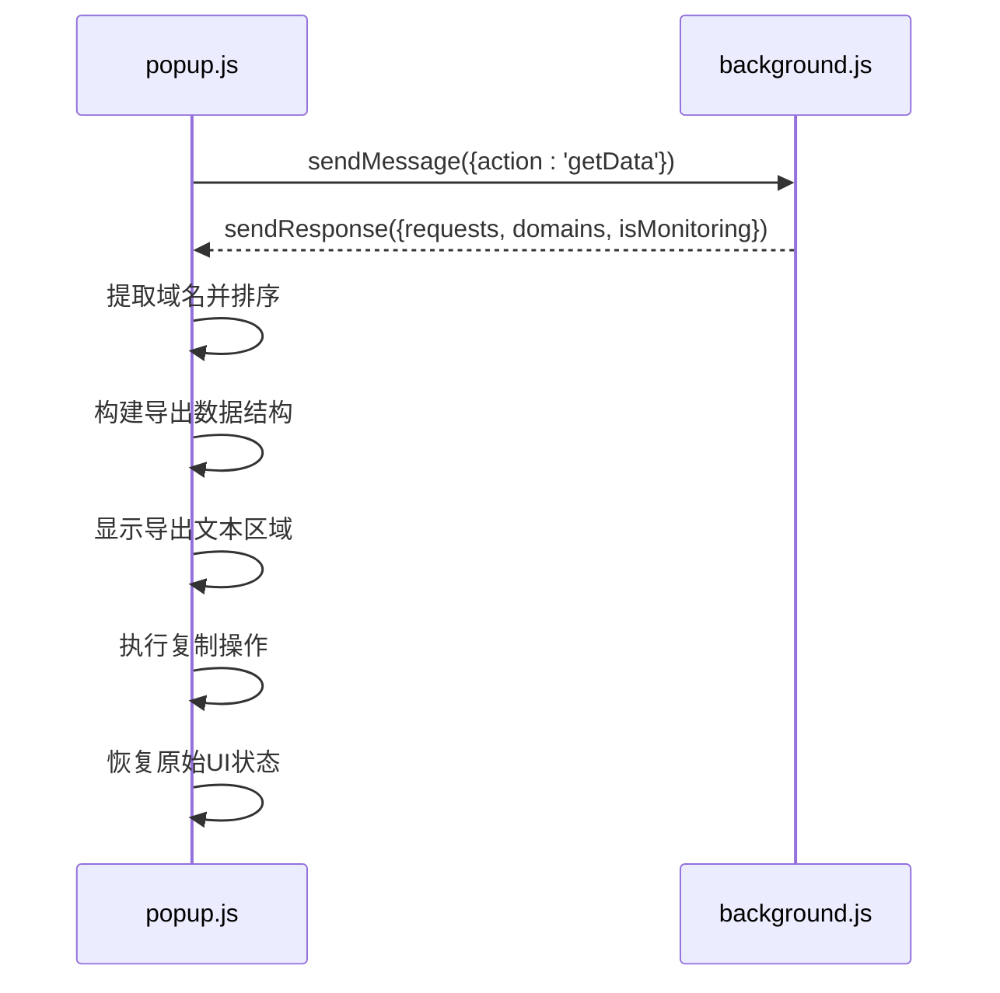
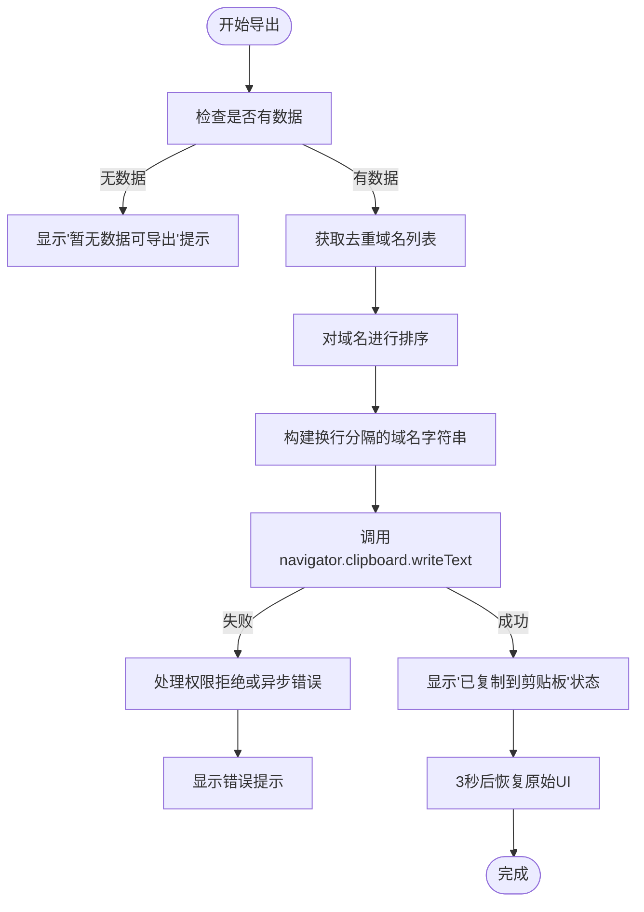
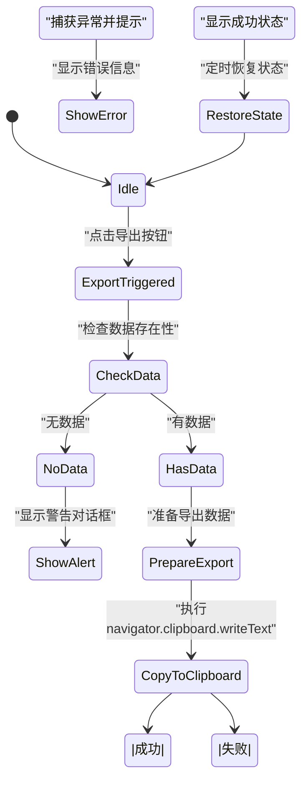
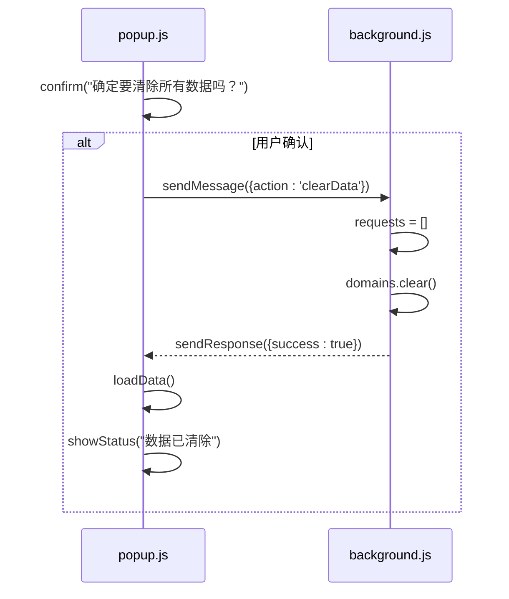
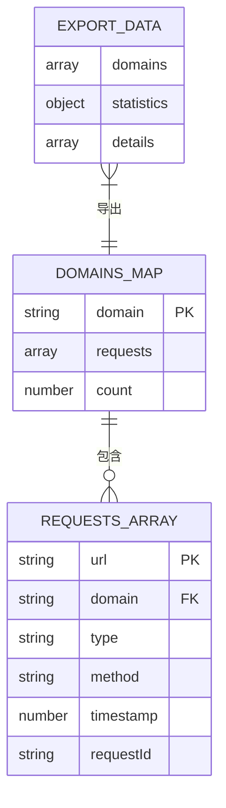

# 数据导出功能

<cite>
**本文档引用的文件**
- [popup.js](file://chrome-extension/popup.js) - *已更新：全局监控功能*
- [background.js](file://chrome-extension/background.js) - *已更新：全局监控功能*
- [popup.html](file://chrome-extension/popup.html)
</cite>

## 更新摘要
**变更内容**
- 更新了数据导出流程，以反映全局监控功能的变更
- 修正了剪贴板写入机制，从`document.execCommand`更新为`navigator.clipboard.writeText`
- 更新了错误处理与用户反馈部分，增加了现代API的异常处理
- 修正了数据清除功能的实现细节
- 更新了所有受影响的图表和源码引用

### 目录
1. [简介](#简介)
2. [核心组件分析](#核心组件分析)
3. [数据导出流程](#数据导出流程)
4. [剪贴板写入机制](#剪贴板写入机制)
5. [错误处理与用户反馈](#错误处理与用户反馈)
6. [数据清除功能](#数据清除功能)
7. [内存管理与用户体验](#内存管理与用户体验)
8. [最佳实践建议](#最佳实践建议)

## 简介
本文档详细解析网络监控扩展中的数据导出功能，重点介绍一键复制去重域名列表到剪贴板的实现方式。系统通过Chrome扩展架构，在popup界面触发导出操作，将收集的网络请求数据转换为结构化格式并写入剪贴板，同时提供完善的数据清除功能以重置监控状态。由于最近的代码变更，监控范围已扩大到所有标签页，影响了数据导出功能的输出内容。

## 核心组件分析

### 数据结构设计
系统采用Map数据结构存储域名信息，实现了高效的去重和统计功能。`domains` Map以域名作为键，对应的请求数组作为值，确保每个域名只存储一次，自动实现去重效果。

**Section sources**
- [popup.js](file://chrome-extension/popup.js#L0-L255)
- [background.js](file://chrome-extension/background.js#L0-L109)

## 数据导出流程

### 域名列表生成
`exportDomains`函数首先通过`chrome.runtime.sendMessage`向background脚本发送`getData`请求，获取当前收集的所有网络请求数据。收到响应后，从返回的域名数组中提取域名字段，并进行排序处理。由于监控范围已扩大到所有标签页，现在收集的数据量显著增加。

**Diagram sources**
- [popup.js](file://chrome-extension/popup.js#L181-L223)
- [background.js](file://chrome-extension/background.js#L0-L56)

**Section sources**
- [popup.js](file://chrome-extension/popup.js#L181-L223)

## 剪贴板写入机制

### 复制功能实现
系统已升级为使用现代的`navigator.clipboard.writeText` API将格式化的域名列表写入剪贴板。在执行复制前，先将域名列表转换为换行分隔的字符串格式，并通过Promise链式调用处理异步操作。

**Diagram sources**
- [popup.js](file://chrome-extension/popup.js#L181-L223)
- [netscope.html](file://netscope.html#L769)

**Section sources**
- [popup.js](file://chrome-extension/popup.js#L181-L223)
- [netscope.html](file://netscope.html#L769)

## 错误处理与用户反馈

### 异常情况处理
系统实现了多层次的错误处理机制。当没有可导出数据时，会弹出警告对话框提示用户"暂无数据可导出"。使用现代剪贴板API时，系统会处理权限拒绝或异步失败的情况，并提供相应的用户反馈。

**Diagram sources**
- [popup.js](file://chrome-extension/popup.js#L181-L223)

**Section sources**
- [popup.js](file://chrome-extension/popup.js#L181-L223)

## 数据清除功能

### 内存清理机制
`clearData`函数在background脚本中重置所有收集的数据。通过将`requests`数组重新赋值为空数组，并调用`domains.clear()`方法清空Map对象，有效释放内存资源。此功能在用户确认后执行，避免误操作。

**Diagram sources**
- [popup.js](file://chrome-extension/popup.js#L225-L231)
- [background.js](file://chrome-extension/background.js#L106-L109)

**Section sources**
- [popup.js](file://chrome-extension/popup.js#L225-L231)
- [background.js](file://chrome-extension/background.js#L106-L109)

## 内存管理与用户体验

### 资源优化策略
系统通过合理的数据结构选择和及时的内存清理，确保长时间运行不会导致内存泄漏。Map数据结构提供了O(1)复杂度的查找和插入操作，而定期的数据清除功能防止了数据无限增长。由于监控范围扩大到所有标签页，内存管理变得更加重要。

#### 性能影响分析
| 操作 | 时间复杂度 | 空间复杂度 | 影响说明 |
|------|-----------|-----------|---------|
| 域名添加 | O(1) | O(1) | 单次请求处理快速 |
| 域名去重 | O(1) | O(1) | Map自动处理重复 |
| 数据导出 | O(n log n) | O(n) | 排序为主要开销 |
| 数据清除 | O(n) | O(1) | 清理所有引用 |

**Section sources**
- [background.js](file://chrome-extension/background.js#L58-L109)

## 最佳实践建议

### 用户交互优化
建议在执行数据清除等不可逆操作前增加二次确认，避免误操作。同时，导出成功后应提供更明显的视觉反馈，如使用toast通知而非短暂的状态栏提示。

### 技术改进建议
1. **现代化剪贴板API**: 已将`document.execCommand('copy')`升级为`navigator.clipboard.writeText` API，提供更好的错误处理能力。
2. **增加导出选项**: 提供多种导出格式选择，如纯文本域名列表、CSV表格或自定义分隔符。
3. **批量操作确认**: 对大量数据的操作增加进度提示，提升用户体验。
4. **权限管理**: 在使用剪贴板API前检查权限状态，提供更友好的用户体验。

**Diagram sources**
- [popup.js](file://chrome-extension/popup.js#L181-L223)
- [background.js](file://chrome-extension/background.js#L58-L109)

**Section sources**
- [popup.js](file://chrome-extension/popup.js#L181-L223)
- [background.js](file://chrome-extension/background.js#L58-L109)