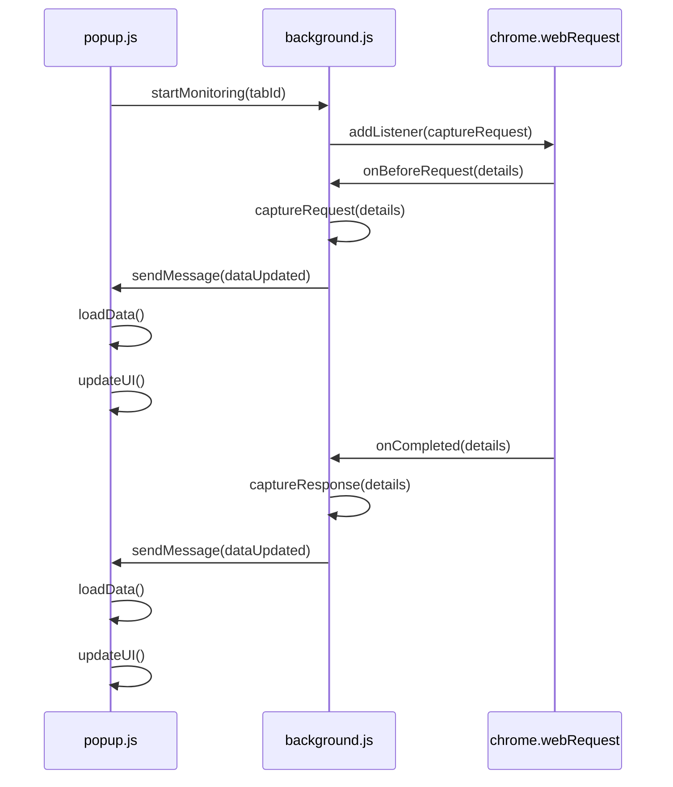
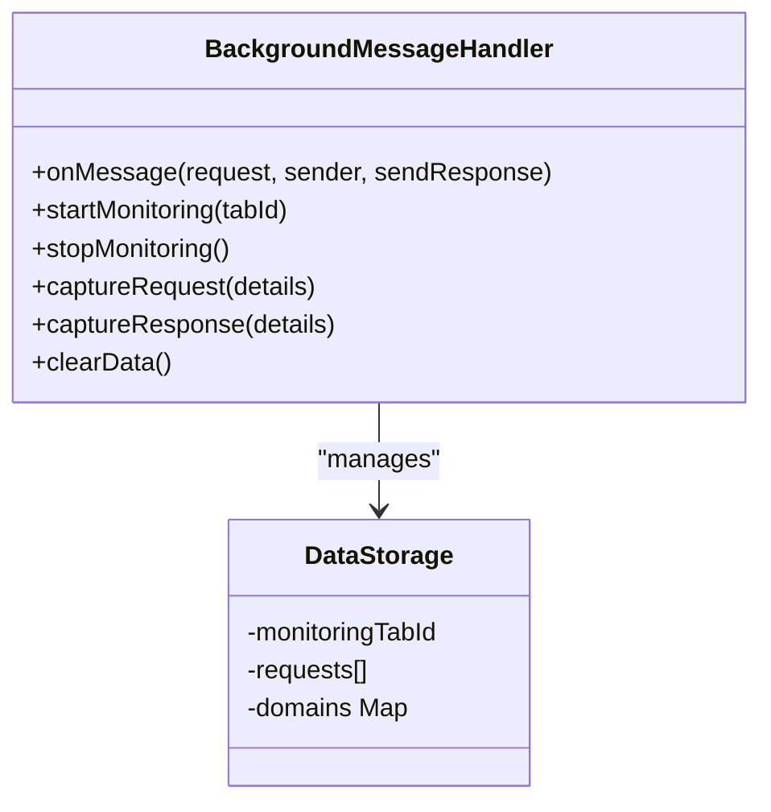
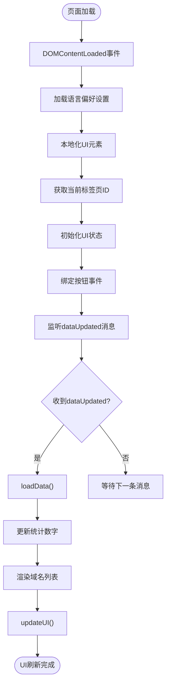
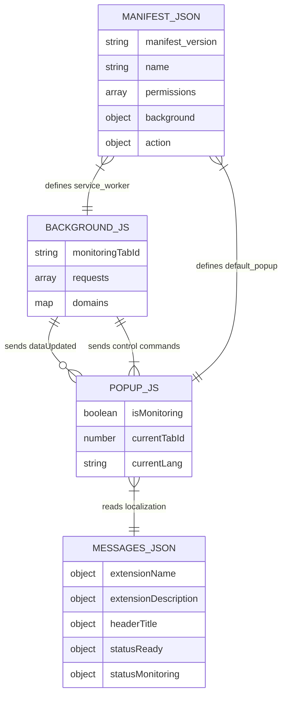

# UI状态同步机制

<cite>
**Referenced Files in This Document**   
- [background.js](file://chrome-extension/background.js)
- [popup.js](file://chrome-extension/popup.js)
- [popup.html](file://chrome-extension/popup.html)
- [messages.json](file://chrome-extension/_locales/en/messages.json)
- [messages.json](file://chrome-extension/_locales/zh_CN/messages.json)
- [manifest.json](file://chrome-extension/manifest.json)
</cite>

## 目录
1. [项目结构](#项目结构)
2. [核心组件](#核心组件)
3. [架构概述](#架构概述)
4. [详细组件分析](#详细组件分析)
5. [依赖分析](#依赖分析)
6. [性能考虑](#性能考虑)
7. [故障排除指南](#故障排除指南)
8. [结论](#结论)

## 项目结构

该Chrome扩展的项目结构清晰地分离了前后台逻辑，通过消息通信系统实现状态同步。核心功能分布在`background.js`和`popup.js`两个主要文件中，分别处理后台网络监控和前端用户界面。

```mermaid
graph TB
subgraph "Frontend"
popup[popup.html]
popupjs[popup.js]
end
subgraph "Backend"
background[background.js]
end
subgraph "Localization"
en[en/messages.json]
zh[zh_CN/messages.json]
end
popup --> popupjs
popupjs --> background : chrome.runtime.sendMessage
background --> popupjs : chrome.runtime.sendMessage
popupjs --> en
popupjs --> zh
```

**Diagram sources**
- [popup.html](file://chrome-extension/popup.html#L1-L237)
- [popup.js](file://chrome-extension/popup.js#L1-L256)
- [background.js](file://chrome-extension/background.js#L1-L110)

**Section sources**
- [popup.html](file://chrome-extension/popup.html#L1-L237)
- [popup.js](file://chrome-extension/popup.js#L1-L256)
- [background.js](file://chrome-extension/background.js#L1-L110)

## 核心组件

本扩展的核心在于前后台脚本之间的状态同步机制，通过Chrome扩展的消息API实现双向通信。`background.js`负责监控网络请求并维护数据状态，而`popup.js`则负责UI渲染和用户交互。

**Section sources**
- [background.js](file://chrome-extension/background.js#L1-L110)
- [popup.js](file://chrome-extension/popup.js#L1-L256)

## 架构概述

该扩展采用典型的Chrome扩展架构模式，将长期运行的后台服务与短暂存在的弹出窗口分离。这种设计确保了即使在弹出窗口关闭的情况下，网络监控功能仍能持续运行。



**Diagram sources**
- [background.js](file://chrome-extension/background.js#L1-L110)
- [popup.js](file://chrome-extension/popup.js#L1-L256)

## 详细组件分析

### 背景脚本分析

`background.js`作为服务工作线程，负责监听来自弹出窗口的消息并执行相应的操作。其核心功能包括启动/停止监控、捕获网络请求以及向弹出窗口发送更新。

#### 消息处理机制


**Diagram sources**
- [background.js](file://chrome-extension/background.js#L1-L110)

**Section sources**
- [background.js](file://chrome-extension/background.js#L1-L110)

### 弹出窗口分析

`popup.js`负责管理用户界面状态，响应用户操作，并通过消息通信与后台脚本保持同步。它实现了完整的状态管理循环，从接收更新到刷新UI。

#### 状态同步流程


**Diagram sources**
- [popup.js](file://chrome-extension/popup.js#L1-L256)

**Section sources**
- [popup.js](file://chrome-extension/popup.js#L1-L256)

### 多语言支持分析

该扩展实现了完整的多语言支持，通过本地化消息系统确保状态提示在不同语言环境下的一致性。

#### 国际化实现
```mermaid
classDiagram
class LanguageManager {
-currentLang
-messages{}
+getMessage(key)
+localizeUI()
+switchLanguage(lang)
}
class MessageStore {
+en{}
+zh_CN{}
}
LanguageManager --> MessageStore : "uses"
popup.js --> LanguageManager : "implements"
```

**Diagram sources**
- [popup.js](file://chrome-extension/popup.js#L42-L82)
- [messages.json](file://chrome-extension/_locales/en/messages.json#L1-L53)
- [messages.json](file://chrome-extension/_locales/zh_CN/messages.json#L1-L53)

**Section sources**
- [popup.js](file://chrome-extension/popup.js#L42-L82)
- [messages.json](file://chrome-extension/_locales/en/messages.json#L1-L53)
- [messages.json](file://chrome-extension/_locales/zh_CN/messages.json#L1-L53)

## 依赖分析

该扩展的依赖关系清晰明了，主要依赖于Chrome扩展API提供的各种功能模块。



**Diagram sources**
- [manifest.json](file://chrome-extension/manifest.json#L1-L33)
- [background.js](file://chrome-extension/background.js#L1-L110)
- [popup.js](file://chrome-extension/popup.js#L1-L256)

**Section sources**
- [manifest.json](file://chrome-extension/manifest.json#L1-L33)
- [background.js](file://chrome-extension/background.js#L1-L110)
- [popup.js](file://chrome-extension/popup.js#L1-L256)

## 性能考虑

该扩展在设计时充分考虑了性能因素，特别是在消息通信和数据处理方面。

1. **异步通信**: 所有消息通信均采用异步方式，避免阻塞主线程
2. **错误处理**: 在发送消息时使用`.catch()`处理可能的错误，防止因弹出窗口未打开而导致异常
3. **内存管理**: 在停止监控时及时移除事件监听器，避免内存泄漏
4. **数据优化**: 只传递必要的统计数据（totalRequests和domainCount），而非完整数据集

**Section sources**
- [background.js](file://chrome-extension/background.js#L95-L100)
- [popup.js](file://chrome-extension/popup.js#L125-L130)

## 故障排除指南

### 常见问题及解决方案

#### 消息丢失处理
当弹出窗口未打开时，后台脚本发送的'dataUpdated'消息可能会被忽略。这是正常行为，因为Chrome扩展的消息系统只向已注册的监听器发送消息。

**解决方案**: 
- 在发送消息时使用`.catch()`捕获可能的错误
- 不需要特殊处理，当用户打开弹出窗口时会立即通过`getData`请求获取最新状态

**Section sources**
- [background.js](file://chrome-extension/background.js#L95-L100)

#### 跨上下文通信错误捕获
由于前后台脚本运行在不同的执行上下文中，直接共享变量是不可能的。必须通过消息通信系统进行数据交换。

**最佳实践**:
- 使用结构化的消息对象，包含明确的`action`字段
- 在`sendResponse`后返回`true`以保持长连接，用于异步响应
- 对所有外部输入进行验证和错误处理

**Section sources**
- [background.js](file://chrome-extension/background.js#L4-L35)

#### 异步时序问题规避
在复杂的异步操作链中，确保正确的执行顺序至关重要。

**策略**:
- 使用`async/await`语法简化异步代码
- 在关键操作完成后才更新UI状态
- 避免在异步操作中间修改共享状态变量

**Section sources**
- [popup.js](file://chrome-extension/popup.js#L132-L150)

## 结论

该Chrome扩展展示了前后台状态同步的优秀实践。通过精心设计的消息通信系统，实现了高效的状态传递和UI更新。`background.js`中的`chrome.runtime.sendMessage`在每次捕获网络请求时触发'dataUpdated'事件，仅传递`totalRequests`和`domainCount`等轻量级统计信息。`popup.js`中的`chrome.runtime.onMessage`监听器接收这些更新并调用`loadData`函数刷新界面。

多语言环境下的状态一致性通过`getMessage`调用链得到保障，该链优先使用当前语言的消息，失败时回退到英文版本。`isMonitoring`状态变量通过消息通信在前后台间同步，`updateUI`函数根据此状态动态切换按钮显示和状态文本。

开发者应特别注意消息通信的异步特性，合理处理可能的错误情况，并遵循Chrome扩展的最佳实践来确保稳定性和性能。