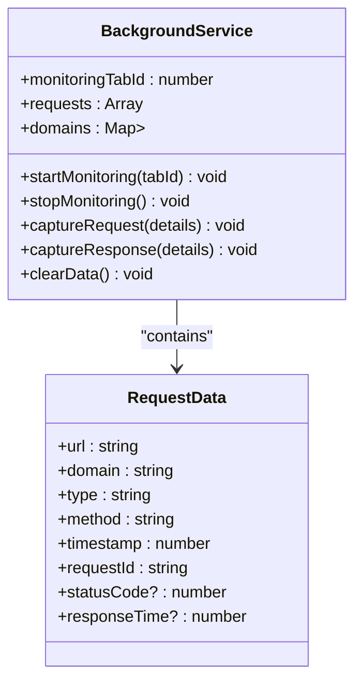
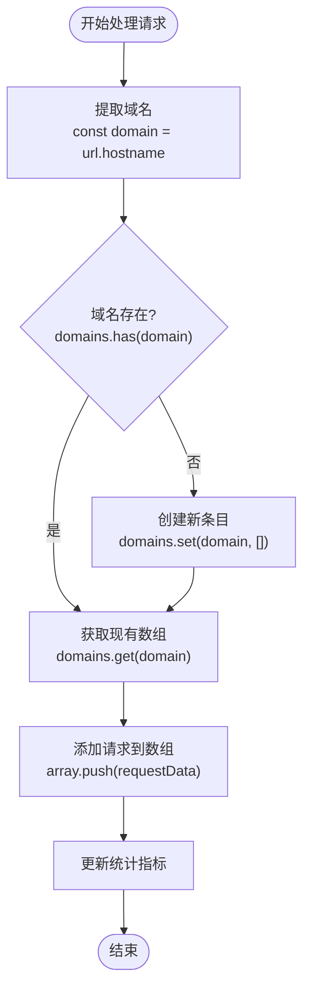
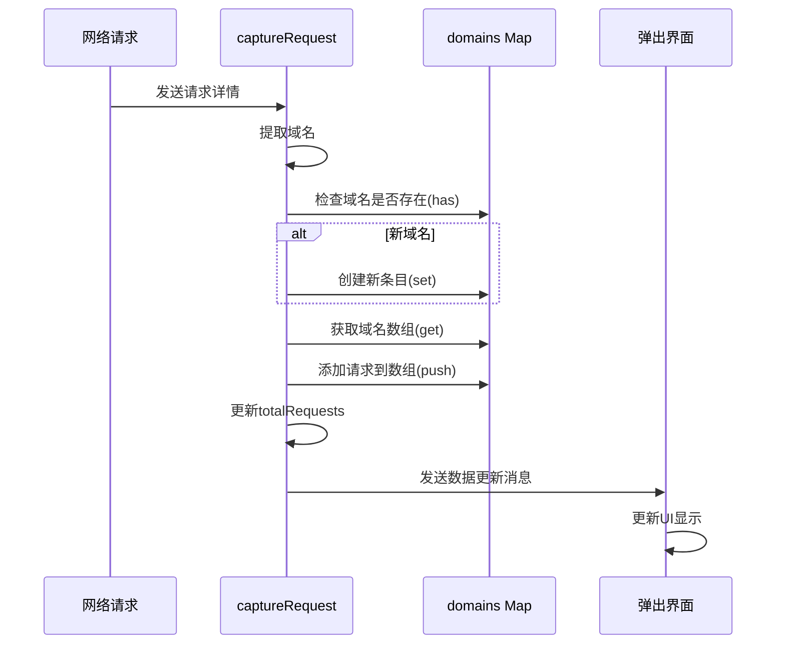

# 数据处理与统计

<cite>
**Referenced Files in This Document**   
- [background.js](file://chrome-extension/background.js)
- [popup.js](file://chrome-extension/popup.js)
</cite>

## 目录
1. [引言](#引言)
2. [核心数据结构设计](#核心数据结构设计)
3. [域名去重算法实现](#域名去重算法实现)
4. [实时数据更新机制](#实时数据更新机制)
5. [内存管理与数据清除](#内存管理与数据清除)
6. [性能优化建议](#性能优化建议)

## 引言
本文深入分析NetScope网络监控工具中域名数据处理与统计的核心技术实现。重点解析`background.js`文件中Map数据结构的应用、去重算法的实现原理，以及相关性能优化策略。通过详细的技术剖析，为开发者提供关于高效数据存储、检索和内存管理的最佳实践指导。

## 核心数据结构设计

在NetScope扩展程序中，`background.js`文件定义了两个关键的数据结构：`requests`数组和`domains` Map对象。这种设计模式体现了对不同类型数据访问需求的深刻理解。

`requests`数组以线性方式存储所有捕获的网络请求，每个请求包含URL、域名、请求类型、方法、时间戳和请求ID等信息。这种结构适合按时间顺序遍历和批量处理请求数据。

相比之下，`domains` Map采用域名字符串作为键，对应的请求数组作为值，实现了高效的域名级数据组织。这种键值对映射结构特别适用于需要快速查找特定域名所有请求的场景。

**Diagram sources**
- [background.js](file://chrome-extension/background.js#L2-L8)

**Section sources**
- [background.js](file://chrome-extension/background.js#L2-L8)

## 域名去重算法实现

### Map数据结构的优势
`domains`变量使用JavaScript的Map数据结构而非普通Object，这一选择带来了多项优势。Map允许任何类型的值作为键，提供了更一致的性能表现，并且内置了size属性来直接获取条目数量，避免了手动计数的开销。

### 增量更新流程
当捕获到新的网络请求时，系统通过`captureRequest`函数执行增量更新。该过程协同使用Map的三个核心方法：`has()`、`set()`和`get()`。

首先，`has()`方法检查目标域名是否已存在于Map中。如果不存在，则使用`set()`方法创建新的键值对，将域名作为键，初始化一个空数组作为值。随后，通过`get()`方法获取对应域名的请求数组，并将新请求推入其中。

这种设计确保了相同域名的所有请求被集中存储，实现了自动的域名去重功能。无论同一域名下有多少个不同路径的请求，它们都被归类到同一个域名条目下进行统计。

**Diagram sources**
- [background.js](file://chrome-extension/background.js#L50-L75)

**Section sources**
- [background.js](file://chrome-extension/background.js#L50-L75)

## 实时数据更新机制

### 数据一致性维护
为了保持`requests`数组与`domains`映射之间的数据一致性，系统采用了同步更新策略。每当有新请求被捕获，它会同时被推送到全局`requests`数组和对应域名的请求数组中。

这种双重存储设计虽然增加了少量内存开销，但极大地提升了查询效率。对于需要查看所有请求的场景，可以直接访问`requests`数组；而对于需要按域名分类统计的场景，则可以高效地遍历`domains` Map。

### 核心指标计算
系统维护两个核心统计指标：`totalRequests`和`domainCount`。前者等于`requests`数组的长度，反映总的请求数量；后者等于`domains` Map的大小，表示唯一域名的数量。

这些指标在每次请求捕获后通过Chrome运行时消息系统发送给弹出界面（popup），实现了实时通知功能。弹出界面接收这些数据并即时更新UI显示，让用户能够看到监控状态的动态变化。

**Diagram sources**
- [background.js](file://chrome-extension/background.js#L50-L80)
- [popup.js](file://chrome-extension/popup.js#L190-L200)

**Section sources**
- [background.js](file://chrome-extension/background.js#L50-L80)
- [popup.js](file://chrome-extension/popup.js#L190-L200)

## 内存管理与数据清除

### 安全清空数据结构
`clearData`函数负责安全地清空所有数据结构并释放内存。该函数将`requests`数组重新赋值为空数组，并调用`domains.clear()`方法清空Map中的所有条目。

这种设计确保了内存的有效回收，防止了潜在的内存泄漏。当用户点击"清除数据"按钮时，系统会执行此函数，使监控工具恢复到初始状态。

值得注意的是，由于JavaScript的垃圾回收机制，重新赋值和清空操作会使得之前存储的所有请求对象失去引用，从而在后续的垃圾回收周期中被自动清理。

**Section sources**
- [background.js](file://chrome-extension/background.js#L105-L109)

## 性能优化建议

### 大规模请求场景下的内存控制
在处理大量网络请求时，内存占用可能成为瓶颈。建议实施以下优化策略：

1. **限制存储数量**：设置最大请求数阈值，当超过限制时自动清理最旧的请求
2. **数据分片存储**：将数据按时间段分片，只保留最近一段时间的详细数据
3. **定期压缩**：对长时间运行的监控会话，定期执行数据压缩操作

### Map相比Object的优势
在此应用场景中，Map相较于普通Object具有明显优势：

- **性能一致性**：Map在各种数据量下的操作性能更加稳定
- **内置迭代器**：原生支持forEach、entries等方法，简化代码逻辑
- **准确的大小统计**：size属性提供精确的条目计数，无需遍历计算
- **避免原型污染**：不会与Object.prototype属性发生冲突

### 避免内存泄漏的编程模式
为防止内存泄漏，应遵循以下最佳实践：

1. **及时清理事件监听器**：在停止监控时移除所有webRequest监听器
2. **断开循环引用**：确保数据结构之间没有不必要的强引用
3. **使用弱引用**：在适当场景考虑使用WeakMap或WeakSet
4. **定期健康检查**：实现内存使用监控机制，及时发现异常增长

这些优化措施共同确保了NetScope扩展程序在长期运行和高负载情况下的稳定性和性能表现。