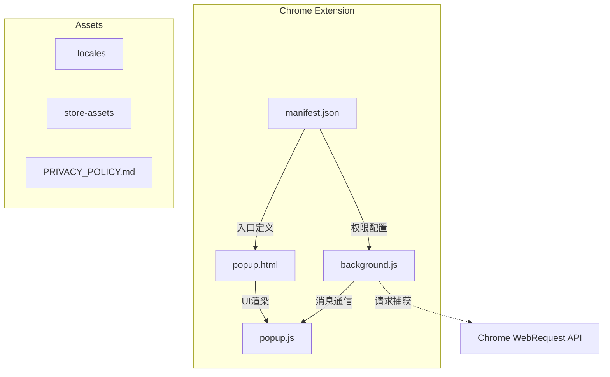
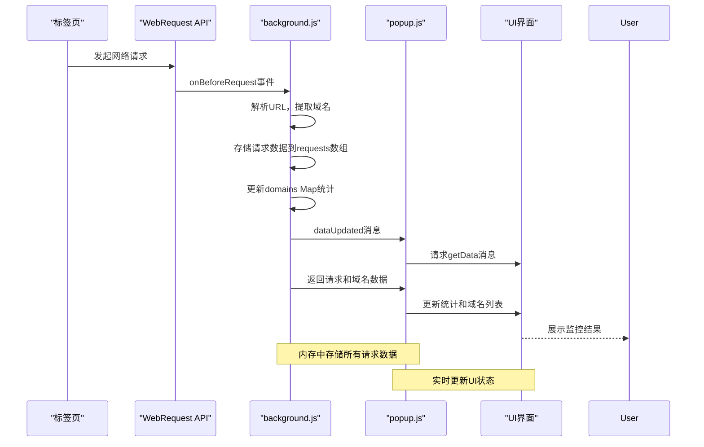
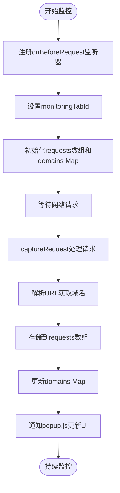
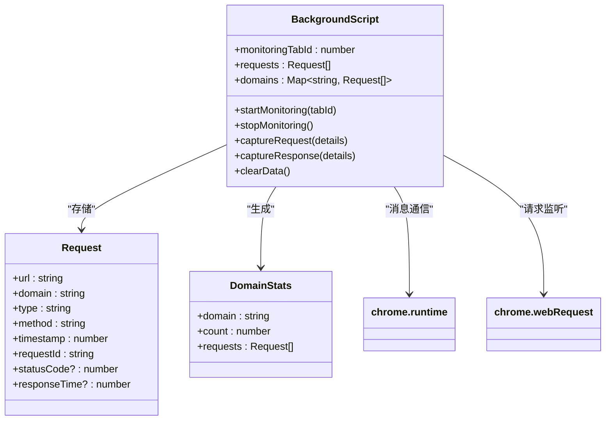
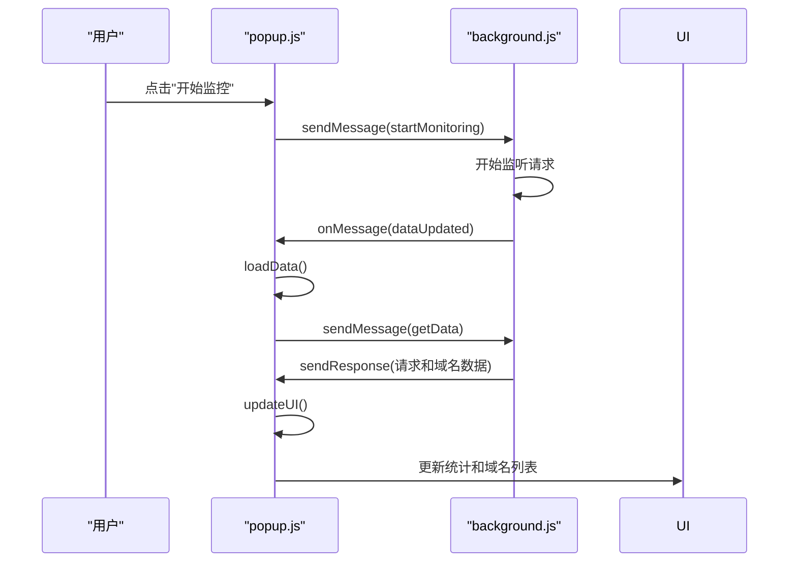
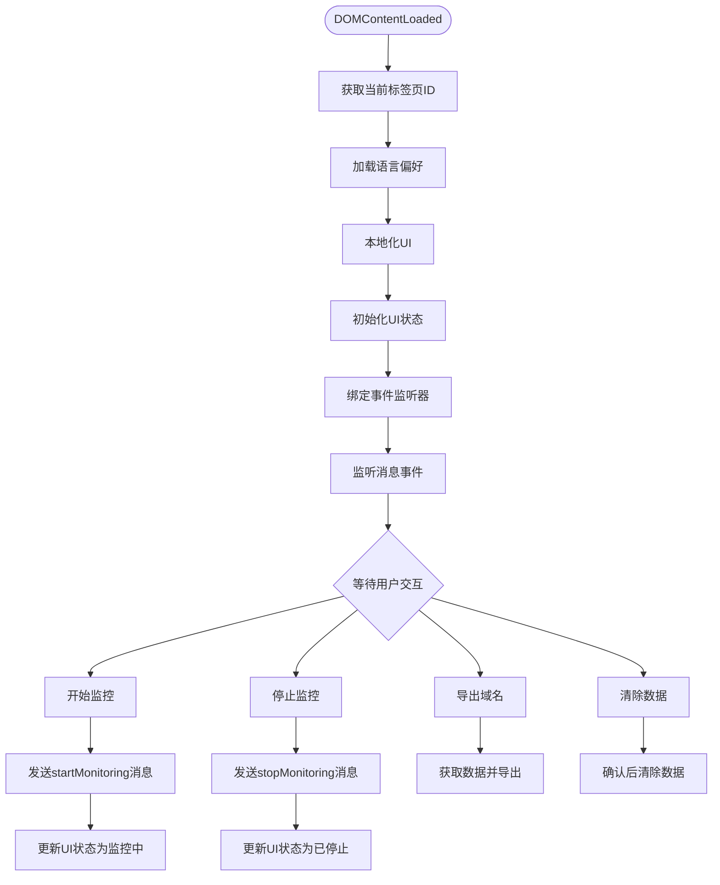

# 核心功能详解

<cite>
**本文档引用的文件**
- [background.js](file://chrome-extension/background.js)
- [popup.js](file://chrome-extension/popup.js)
- [manifest.json](file://chrome-extension/manifest.json)
- [popup.html](file://chrome-extension/popup.html)
</cite>

## 目录
1. [项目结构](#项目结构)
2. [核心组件](#核心组件)
3. [架构概述](#架构概述)
4. [详细组件分析](#详细组件分析)
5. [依赖关系分析](#依赖关系分析)
6. [性能考量](#性能考量)
7. [故障排除指南](#故障排除指南)
8. [结论](#结论)

## 项目结构

该网络监控工具采用典型的Chrome扩展程序结构，主要由后台脚本、弹出界面和清单文件组成。项目根目录包含扩展核心文件和相关资产。



**Diagram sources**
- [manifest.json](file://chrome-extension/manifest.json#L0-L32)
- [background.js](file://chrome-extension/background.js#L0-L109)
- [popup.js](file://chrome-extension/popup.js#L0-L255)

**Section sources**
- [manifest.json](file://chrome-extension/manifest.json#L0-L32)
- [background.js](file://chrome-extension/background.js#L0-L109)

## 核心组件

该扩展的核心功能围绕网络请求监控与域名统计展开，通过`background.js`中的`chrome.webRequest` API实现请求捕获，利用`Map`数据结构进行高效的域名去重与统计，并通过消息通信机制将数据传递给`popup.js`进行UI展示。

**Section sources**
- [background.js](file://chrome-extension/background.js#L0-L109)
- [popup.js](file://chrome-extension/popup.js#L0-L255)

## 架构概述

系统采用分层架构设计，分为数据采集层、数据处理层和用户界面层。数据流从标签页发起的网络请求开始，经过WebRequest API拦截，由后台脚本进行处理和存储，最终通过消息通信传递给弹出界面进行可视化展示。



**Diagram sources**
- [background.js](file://chrome-extension/background.js#L0-L109)
- [popup.js](file://chrome-extension/popup.js#L0-L255)

## 详细组件分析

### 背景脚本分析

#### 网络请求监听机制
背景脚本使用Chrome扩展的`webRequest` API来捕获网络活动。当用户启动监控时，`startMonitoring`函数会注册`onBeforeRequest`和`onCompleted`事件监听器，专门针对指定标签页的所有URL进行监控。



**Diagram sources**
- [background.js](file://chrome-extension/background.js#L34-L56)

#### 域名统计与去重算法
系统使用JavaScript的`Map`数据结构实现高效的域名统计和去重。每个唯一域名作为键，对应的值为该域名下所有请求的数组。这种设计确保了O(1)时间复杂度的查找和插入操作，同时保持了域名的唯一性。



**Diagram sources**
- [background.js](file://chrome-extension/background.js#L58-L109)

### 弹出界面分析

#### 消息通信与数据同步
弹出界面通过`chrome.runtime.sendMessage`与背景脚本进行双向通信。当用户交互触发操作时，如开始监控或获取数据，`popup.js`会发送相应消息；同时，它也监听来自背景脚本的`dataUpdated`事件，实现数据的实时同步。



**Diagram sources**
- [popup.js](file://chrome-extension/popup.js#L132-L179)

#### UI更新与状态管理
`popup.js`实现了完整的状态管理和UI更新逻辑。`updateUI`函数根据当前监控状态动态切换按钮显示，而`loadData`函数负责从背景脚本获取最新数据并渲染到界面上，包括按请求数量排序的域名列表。



**Diagram sources**
- [popup.js](file://chrome-extension/popup.js#L43-L251)

## 依赖关系分析

系统各组件之间通过明确的接口进行交互，形成了清晰的依赖关系链。清单文件定义了必要的权限，背景脚本依赖于Chrome WebRequest API，而弹出界面则依赖于背景脚本提供的数据服务。

```mermaid
graph LR
    manifest[manifest.json] -->|声明权限| webRequest["webRequest API"]
    manifest -->|定义入口| background[background.js]
    manifest -->|定义弹出页| popup[popup.html]
    background -->|使用| webRequest
    background -->|提供数据| popup
    popup -->|请求数据| background
    popup