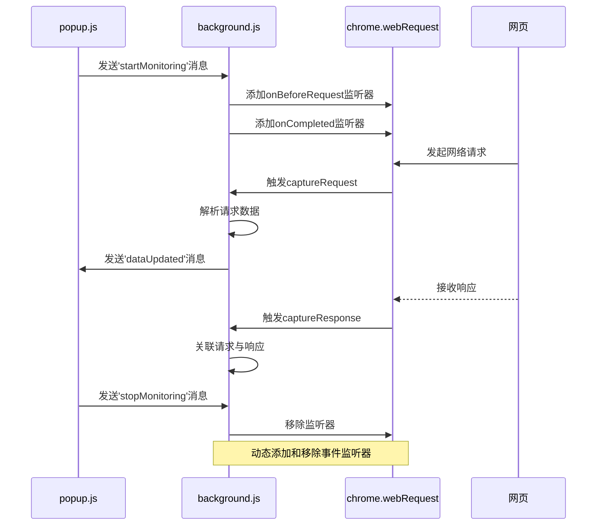
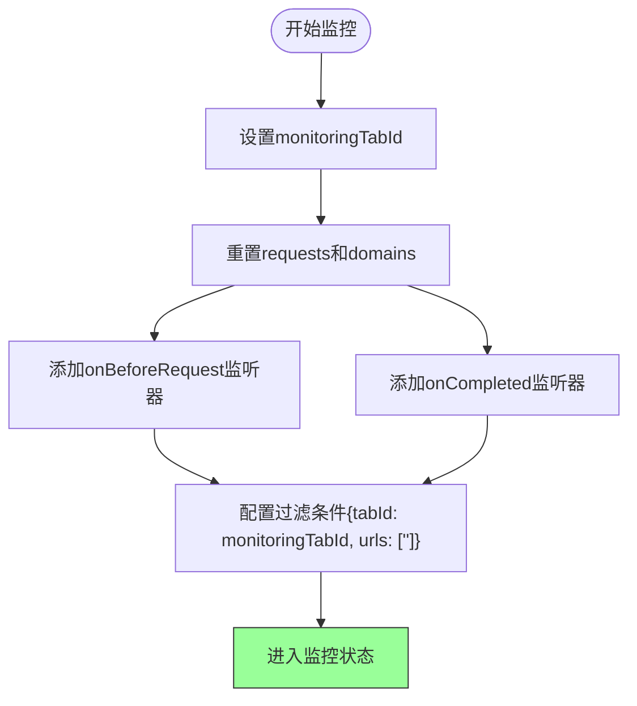
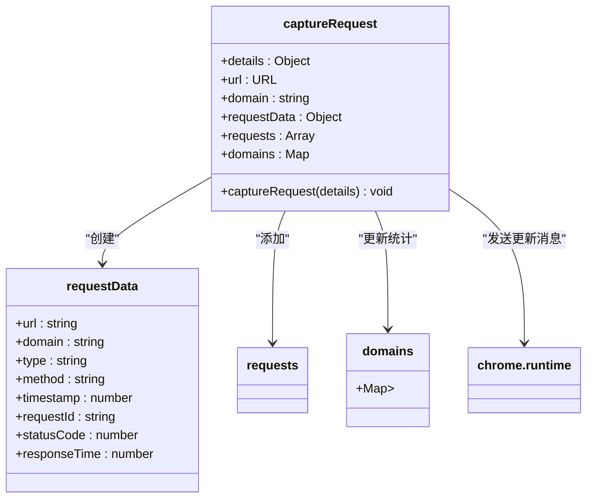
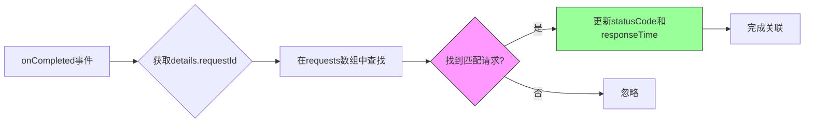
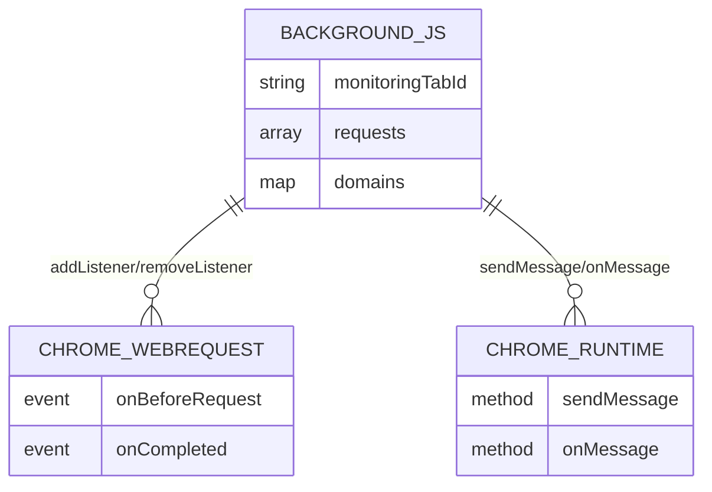

# 请求捕获机制

<cite>
**本文档引用的文件**
- [background.js](file://chrome-extension/background.js)
- [manifest.json](file://chrome-extension/manifest.json)
</cite>

## 目录
1. [引言](#引言)
2. [项目结构](#项目结构)
3. [核心组件](#核心组件)
4. [架构概述](#架构概述)
5. [详细组件分析](#详细组件分析)
6. [依赖分析](#依赖分析)
7. [性能考虑](#性能考虑)
8. [故障排除指南](#故障排除指南)
9. [结论](#结论)

## 引言

本技术文档深入解析了Chrome扩展程序中实现网络请求捕获的核心机制。重点分析了`background.js`文件中通过`chrome.webRequest` API实现的请求监听功能，详细阐述了从请求捕获、数据处理到资源管理的完整流程。该机制为开发者提供了强大的网络活动监控能力，可用于性能分析、安全审计和流量统计等场景。

## 项目结构

该项目是一个典型的Chrome扩展程序结构，主要包含扩展核心文件和辅助资产文件。

```mermaid
graph TB
subgraph "Chrome扩展"
background[background.js]
manifest[manifest.json]
popup[popup.html]
popupjs[popup.js]
locales[_locales/]
end
subgraph "资产与文档"
store[store-assets/]
docs[文档文件]
end
background --> manifest : "服务工作线程"
popup --> popupjs : "页面逻辑"
manifest --> background : "后台配置"
manifest --> popup : "弹出页配置"
```

**Diagram sources**
- [manifest.json](file://chrome-extension/manifest.json#L1-L33)
- [background.js](file://chrome-extension/background.js#L1-L110)

**Section sources**
- [manifest.json](file://chrome-extension/manifest.json#L1-L33)
- [background.js](file://chrome-extension/background.js#L1-L110)

## 核心组件

系统的核心功能由`background.js`中的几个关键函数构成：`startMonitoring`负责启动请求监控，`stopMonitoring`用于停止监控并释放资源，`captureRequest`处理请求捕获逻辑，而`captureResponse`则负责响应信息的收集。这些组件协同工作，实现了完整的请求-响应生命周期监控。

**Section sources**
- [background.js](file://chrome-extension/background.js#L34-L104)

## 架构概述

系统采用事件驱动架构，通过Chrome扩展的消息传递机制在不同组件间通信。`background.js`作为服务工作线程，负责核心的网络请求监听和数据管理。



**Diagram sources**
- [background.js](file://chrome-extension/background.js#L1-L110)
- [popup.js](file://chrome-extension/popup.js#L132-L151)

## 详细组件分析

### 请求监听机制分析

#### 事件监听器注册逻辑
系统通过`chrome.webRequest` API的两个关键事件实现请求捕获：`onBeforeRequest`和`onCompleted`。`onBeforeRequest`在请求发出前触发，允许捕获请求的初始信息；`onCompleted`在请求完成后触发，提供响应相关数据。



**Diagram sources**
- [background.js](file://chrome-extension/background.js#L34-L50)

**Section sources**
- [background.js](file://chrome-extension/background.js#L34-L50)

#### 请求数据捕获与处理
`captureRequest`函数是请求数据处理的核心，它通过URL对象解析提取域名信息，并构建标准化的请求数据对象。



**Diagram sources**
- [background.js](file://chrome-extension/background.js#L58-L95)

### 请求-响应关联机制

系统利用`requestId`作为唯一标识符，实现请求与响应的精确匹配。`captureResponse`函数通过查找具有相同`requestId`的请求记录，将响应信息（如状态码和响应时间）补充到原始请求数据中。



**Diagram sources**
- [background.js](file://chrome-extension/background.js#L97-L104)

### 监控生命周期管理

系统提供了完整的监控生命周期管理功能，确保资源的正确分配与释放。

```mermaid
stateDiagram-v2
[*] --> Idle
Idle --> Monitoring : startMonitoring()
Monitoring --> Idle : stopMonitoring()
state Monitoring {
[*] --> CapturingRequest
CapturingRequest --> ProcessingResponse : onCompleted
ProcessingResponse --> CapturingRequest
}
note right of Monitoring
监听onBeforeRequest和onCompleted事件
end
note left of Idle
无事件监听器
end
```

**Diagram sources**
- [background.js](file://chrome-extension/background.js#L34-L56)

## 依赖分析

系统的主要依赖关系集中在Chrome扩展API的使用上。



**Diagram sources**
- [background.js](file://chrome-extension/background.js#L1-L110)
- [manifest.json](file://chrome-extension/manifest.json#L1-L33)

**Section sources**
- [background.js](file://chrome-extension/background.js#L1-L110)
- [manifest.json](file://chrome-extension/manifest.json#L1-L33)

## 性能考虑

系统在设计时考虑了性能优化和资源管理：
- 使用`Map`数据结构存储域名统计，确保O(1)的查找和插入性能
- 在停止监控时及时移除事件监听器，避免内存泄漏
- 对popup消息发送使用try-catch包裹，防止因popup未打开导致的错误中断
- 通过`requestId`快速索引实现请求-响应关联，避免全数组遍历的性能损耗

## 故障排除指南

### 调试建议
当遇到请求未被正确捕获的问题时，可按照以下步骤排查：

1. **检查权限配置**：确认`manifest.json`中已正确声明`webRequest`权限和`host_permissions`
2. **验证监控状态**：确保`startMonitoring`已被调用且`monitoringTabId`正确设置
3. **查看控制台日志**：检查是否有"Error capturing request"相关的错误输出
4. **确认事件监听器**：通过Chrome扩展管理页面检查事件监听器是否已成功注册

### 常见问题解决方案
- **跨域请求捕获失败**：确保`host_permissions`包含目标域名或使用`"<all_urls>"`
- **内存泄漏**：始终在适当时候调用`stopMonitoring`以移除事件监听器
- **数据不完整**：检查`onBeforeRequest`监听器是否正确配置了`["requestBody"]`参数

**Section sources**
- [background.js](file://chrome-extension/background.js#L58-L95)
- [manifest.json](file://chrome-extension/manifest.json#L1-L33)

## 结论

本文档详细解析了Chrome扩展中网络请求捕获的实现机制。通过`chrome.webRequest` API的合理运用，系统实现了对指定标签页所有网络请求的全面监控。关键的设计要点包括：使用`tabId`和`urls`过滤条件精确控制监控范围，利用`requestId`实现请求-响应的准确关联，以及通过动态添加/移除监听器确保资源的高效管理。这一机制为开发者提供了强大的网络活动分析能力，同时通过合理的架构设计保证了系统的稳定性和性能。