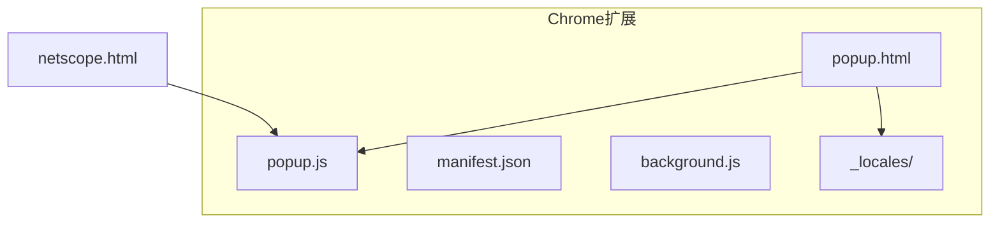
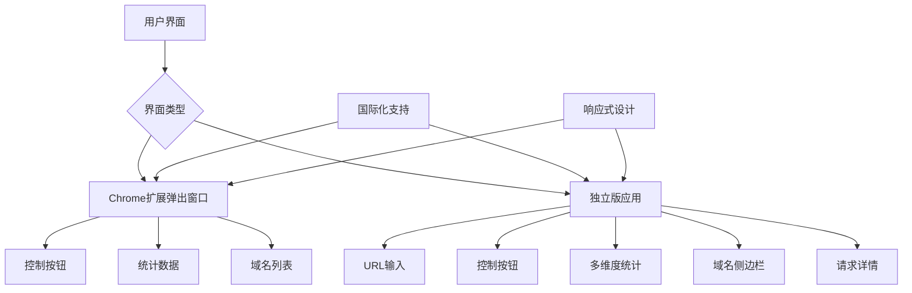
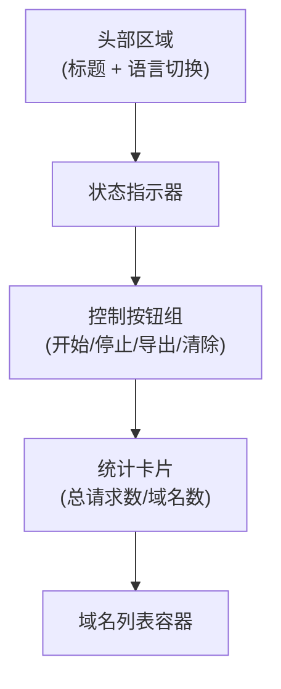
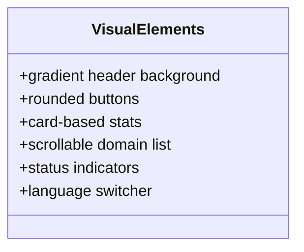
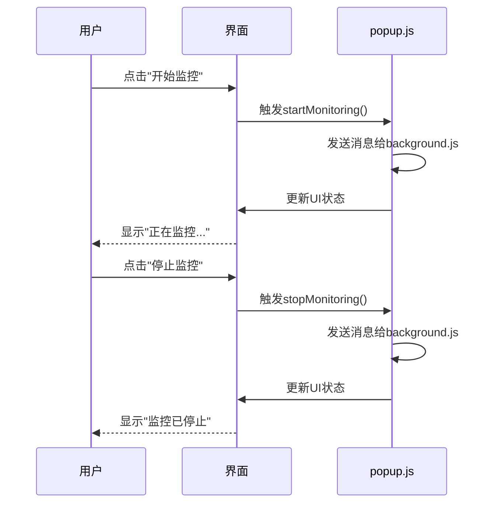
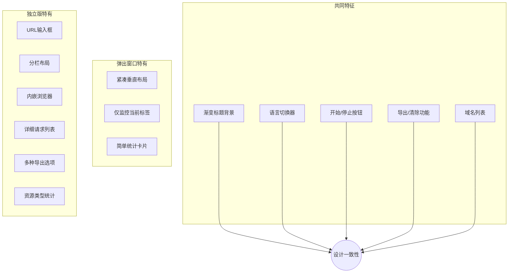
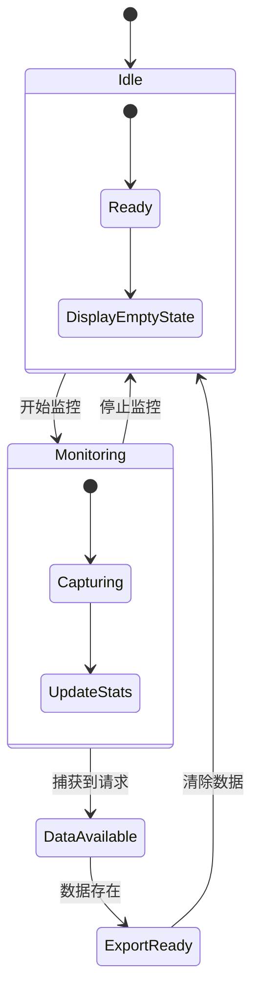
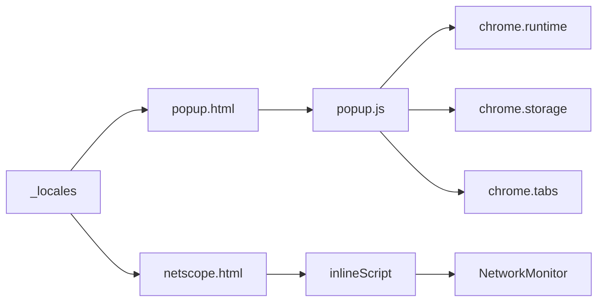

# 用户界面设计

<cite>
**本文档中引用的文件**
- [popup.html](file://chrome-extension/popup.html)
- [popup.js](file://chrome-extension/popup.js)
- [netscope.html](file://netscope.html)
- [messages.json](file://chrome-extension/_locales/en/messages.json)
- [messages.json](file://chrome-extension/_locales/zh_CN/messages.json)
</cite>

## 目录
1. [简介](#简介)
2. [项目结构](#项目结构)
3. [核心组件](#核心组件)
4. [架构概述](#架构概述)
5. [详细组件分析](#详细组件分析)
6. [依赖关系分析](#依赖关系分析)
7. [性能考虑](#性能考虑)
8. [故障排除指南](#故障排除指南)
9. [结论](#结论)

## 简介
本项目包含两个主要用户界面：Chrome扩展弹出窗口（popup.html）和独立版网络监控工具（netscope.html）。两者都提供网络请求监控功能，但使用场景和功能范围有所不同。弹出窗口作为浏览器扩展的一部分，专注于当前标签页的监控；而独立版提供更完整的网页嵌入式监控体验。

## 项目结构



**图示来源**
- [popup.html](file://chrome-extension/popup.html#L1-L236)
- [netscope.html](file://netscope.html#L1-L799)

**章节来源**
- [popup.html](file://chrome-extension/popup.html#L1-L236)
- [netscope.html](file://netscope.html#L1-L799)

## 核心组件

该系统的核心UI组件包括控制按钮、统计数据显示区域和域名列表容器。这些组件在两种界面中都有实现，但布局和功能有所差异。弹出窗口采用紧凑型设计，适合快速访问；而独立版提供更丰富的数据展示和交互功能。

**章节来源**
- [popup.html](file://chrome-extension/popup.html#L1-L236)
- [netscope.html](file://netscope.html#L1-L799)

## 架构概述



**图示来源**
- [popup.html](file://chrome-extension/popup.html#L1-L236)
- [netscope.html](file://netscope.html#L1-L799)

## 详细组件分析

### 弹出窗口分析

#### 结构布局
弹出窗口采用垂直布局，从上到下依次为：标题区、状态指示器、控制按钮区、统计卡片区和域名列表区。这种布局优化了有限的空间利用，确保关键功能易于访问。



**图示来源**
- [popup.html](file://chrome-extension/popup.html#L1-L236)

**章节来源**
- [popup.html](file://chrome-extension/popup.html#L1-L236)

#### 视觉元素与样式
CSS样式实现了现代化的视觉效果，包括渐变背景、圆角按钮和阴影效果。响应式设计确保在不同设备上的良好显示，通过固定宽度（400px）和最小高度（500px）来保证可用性。



**图示来源**
- [popup.html](file://chrome-extension/popup.html#L1-L236)

#### 交互行为
JavaScript通过事件监听器实现按钮功能，动态更新DOM内容。状态转换机制清晰地反映了监控状态的变化，从"准备就绪"到"正在监控"再到"已停止"。



**图示来源**
- [popup.js](file://chrome-extension/popup.js#L1-L255)
- [popup.html](file://chrome-extension/popup.html#L1-L236)

**章节来源**
- [popup.js](file://chrome-extension/popup.js#L1-L255)

### 独立版应用分析

#### 扩展版与独立版对比
虽然两个界面共享相似的设计语言和核心功能，但在UI上有显著差异。独立版提供了URL输入框、更详细的统计信息、分栏布局以及内嵌iframe显示被监控页面。



**图示来源**
- [popup.html](file://chrome-extension/popup.html#L1-L236)
- [netscope.html](file://netscope.html#L1-L799)

**章节来源**
- [popup.html](file://chrome-extension/popup.html#L1-L236)
- [netscope.html](file://netscope.html#L1-L799)

#### 内容刷新机制
JavaScript通过PerformanceObserver API捕获网络请求，并实时更新UI。数据流从底层监控到前端展示形成了闭环，确保用户看到的是最新信息。

```mermaid
flowchart LR
A[PerformanceObserver] --> |捕获请求| B[NetworkMonitor]
B --> |存储数据| C[requests数组]
C --> |按域名分组| D[domains Map]
D --> |排序处理| E[renderDomainList()]
E --> |更新DOM| F[域名列表]
D --> |计算统计| G[updateUI()]
G --> |更新元素| H[统计数值]
```

**图示来源**
- [netscope.html](file://netscope.html#L1-L799)

### UI状态转换说明

#### 监控状态变化
界面根据监控状态进行动态调整，体现了清晰的状态管理模式。初始状态下显示"准备就绪"，开始监控后变为"正在监控..."，并隐藏开始按钮显示停止按钮。



**图示来源**
- [popup.js](file://chrome-extension/popup.js#L1-L255)
- [netscope.html](file://netscope.html#L1-L799)

**章节来源**
- [popup.js](file://chrome-extension/popup.js#L1-L255)

## 依赖关系分析



**图示来源**
- [popup.html](file://chrome-extension/popup.html#L1-L236)
- [popup.js](file://chrome-extension/popup.js#L1-L255)
- [netscope.html](file://netscope.html#L1-L799)

**章节来源**
- [popup.js](file://chrome-extension/popup.js#L1-L255)

## 性能考虑
两个界面都采用了轻量级的设计理念，避免不必要的重绘和布局抖动。弹出窗口限制了最大高度以防止遮挡过多屏幕空间，而独立版使用虚拟滚动的概念（通过overflow-y:auto）来处理大量域名数据。

## 故障排除指南

### 常见问题
当用户遇到界面不更新或功能失效时，可能的原因包括：
-