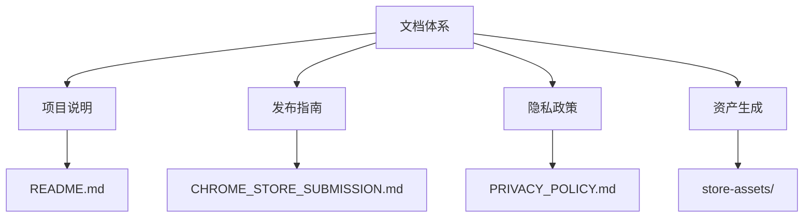
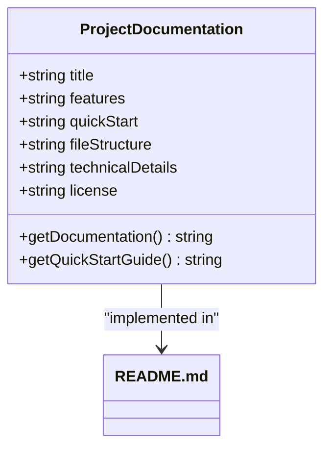
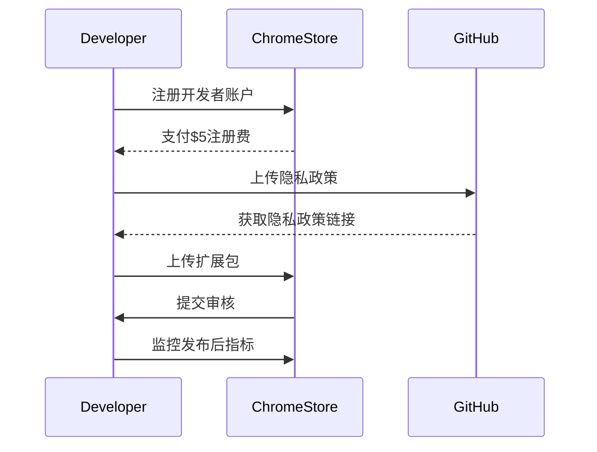
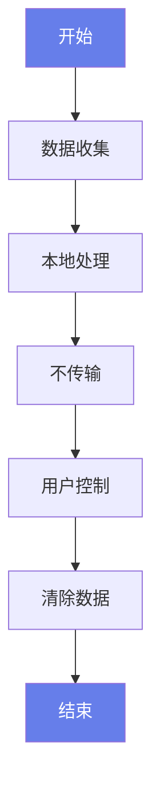
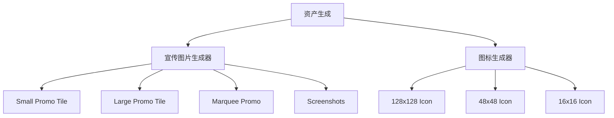
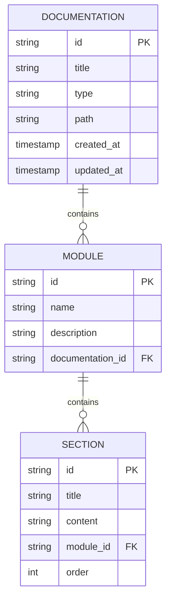
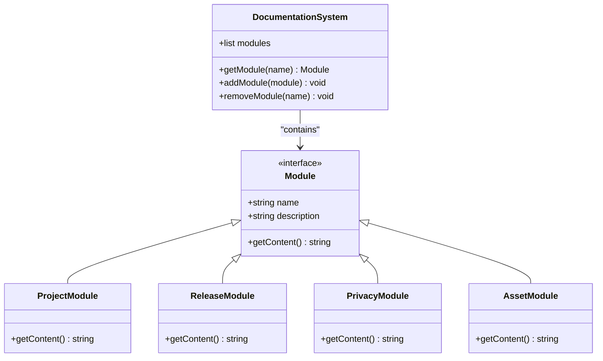
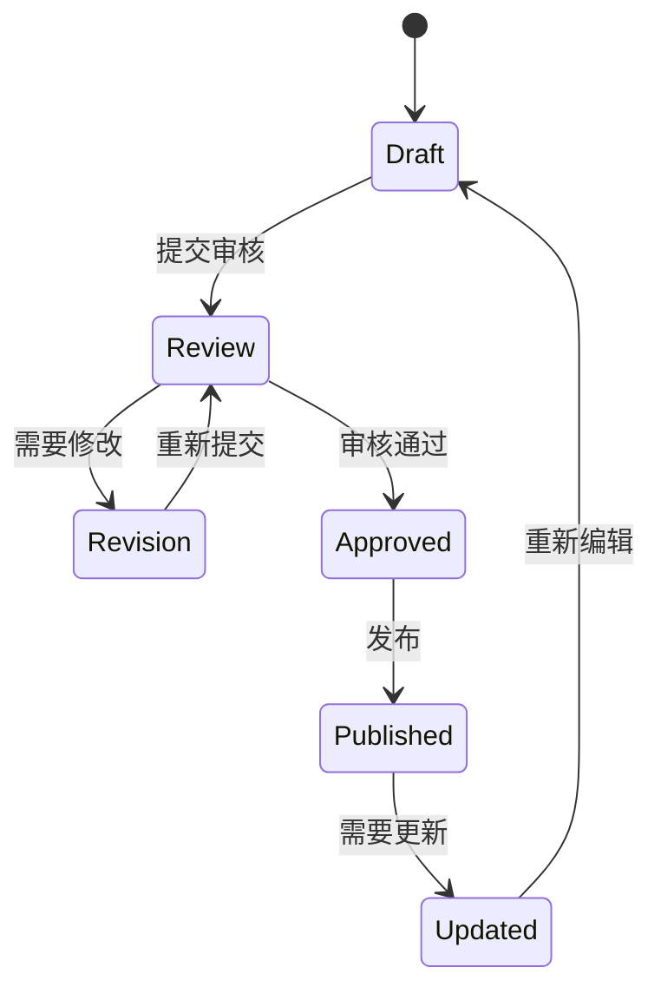

# 系统化文档体系

<cite>
**本文档引用文件**   
- [README.md](file://README.md)
- [CHROME_STORE_SUBMISSION.md](file://CHROME_STORE_SUBMISSION.md)
- [PRIVACY_POLICY.md](file://PRIVACY_POLICY.md)
- [netscope.html](file://netscope.html)
- [manifest.json](file://chrome-extension/manifest.json)
- [background.js](file://chrome-extension/background.js)
- [popup.js](file://chrome-extension/popup.js)
- [popup.html](file://chrome-extension/popup.html)
- [STORE_LISTING.md](file://store-assets/STORE_LISTING.md)
- [messages.json](file://chrome-extension/_locales/en/messages.json)
- [messages.json](file://chrome-extension/_locales/zh_CN/messages.json)
- [generate-promo-images.html](file://store-assets/generate-promo-images.html)
- [generate-store-icon.html](file://store-assets/generate-store-icon.html)
</cite>

## 目录
1. [文档体系概述](#文档体系概述)
2. [核心文档模块](#核心文档模块)
3. [文档内容组织原则](#文档内容组织原则)
4. [维护流程与贡献指南](#维护流程与贡献指南)
5. [文档导航路径](#文档导航路径)

## 文档体系概述

NetScope项目构建了一个全面的文档体系，旨在为开发者、贡献者和用户提供清晰的指导和信息。该体系涵盖了从项目介绍到发布流程的各个方面，确保所有相关方都能快速理解和使用项目。

文档体系主要分为四个核心模块：项目说明、发布指南、隐私政策和资产生成。这些模块相互关联，共同构成了完整的项目文档生态。

**文档体系结构图**


**Diagram sources**
- [README.md](file://README.md#L1-L197)
- [CHROME_STORE_SUBMISSION.md](file://CHROME_STORE_SUBMISSION.md#L1-L163)
- [PRIVACY_POLICY.md](file://PRIVACY_POLICY.md#L1-L93)
- [store-assets/](file://store-assets/)

## 核心文档模块

### 项目说明模块

项目说明模块是文档体系的核心，主要由README.md文件构成，为用户提供全面的项目介绍和使用指南。

该模块详细介绍了NetScope的功能特点、快速开始指南、文件结构和技术细节。通过中英文双语支持，确保全球用户都能轻松理解。



**Diagram sources**
- [README.md](file://README.md#L1-L197)

**Section sources**
- [README.md](file://README.md#L1-L197)

### 发布指南模块

发布指南模块为开发者提供了完整的Chrome Web Store发布流程，确保扩展能够顺利上线。

该模块详细列出了发布前的准备工作、具体步骤、可能遇到的问题及解决方案。通过清晰的步骤分解，降低了发布过程的复杂性。



**Diagram sources**
- [CHROME_STORE_SUBMISSION.md](file://CHROME_STORE_SUBMISSION.md#L1-L163)

**Section sources**
- [CHROME_STORE_SUBMISSION.md](file://CHROME_STORE_SUBMISSION.md#L1-L163)

### 隐私政策模块

隐私政策模块是项目合规性的重要组成部分，详细说明了数据收集、使用和存储的政策。

该模块强调了NetScope对用户隐私的尊重，明确指出所有数据都在本地处理，不会传输到外部服务器。这增强了用户对工具的信任。



**Diagram sources**
- [PRIVACY_POLICY.md](file://PRIVACY_POLICY.md#L1-L93)

**Section sources**
- [PRIVACY_POLICY.md](file://PRIVACY_POLICY.md#L1-L93)

### 资产生成模块

资产生成模块包含了一系列HTML工具，用于生成发布所需的视觉资产。

该模块通过generate-promo-images.html和generate-store-icon.html两个工具，帮助开发者快速创建符合Chrome Web Store要求的宣传图片和图标。



**Diagram sources**
- [generate-promo-images.html](file://store-assets/generate-promo-images.html#L1-L545)
- [generate-store-icon.html](file://store-assets/generate-store-icon.html#L1-L356)

**Section sources**
- [store-assets/](file://store-assets/)
- [generate-promo-images.html](file://store-assets/generate-promo-images.html#L1-L545)
- [generate-store-icon.html](file://store-assets/generate-store-icon.html#L1-L356)

## 文档内容组织原则

### 分层信息架构

文档体系采用分层信息架构，从宏观到微观逐步展开。顶层提供概述，底层提供具体实现细节。

这种结构确保用户可以根据自己的需求快速定位到相关信息，无论是需要快速了解项目概览还是深入研究技术细节。



**Diagram sources**
- [README.md](file://README.md#L1-L197)
- [CHROME_STORE_SUBMISSION.md](file://CHROME_STORE_SUBMISSION.md#L1-L163)

### 模块化设计

文档体系采用模块化设计，每个模块独立且完整，可以单独使用或组合使用。

这种设计提高了文档的可维护性和可扩展性，当需要更新某个部分时，只需修改相应的模块，而不影响其他部分。



**Diagram sources**
- [README.md](file://README.md#L1-L197)
- [CHROME_STORE_SUBMISSION.md](file://CHROME_STORE_SUBMISSION.md#L1-L163)
- [PRIVACY_POLICY.md](file://PRIVACY_POLICY.md#L1-L93)
- [store-assets/](file://store-assets/)

### 一致性原则

文档体系遵循一致性原则，确保所有文档在风格、术语和格式上保持统一。

这种一致性降低了用户的学习成本，使用户在阅读不同文档时能够快速适应，提高了文档的可用性。



**Diagram sources**
- [README.md](file://README.md#L1-L197)
- [CHROME_STORE_SUBMISSION.md](file://CHROME_STORE_SUBMISSION.md#L1-L163)

## 维护流程与贡献指南

### 文档维护流程

文档维护流程确保文档能够随着项目的发展而及时更新，保持与代码的一致性。

维护流程包括版本控制、审核机制和更新策略，确保文档质量。

```mermaid
sequenceDiagram
    participant Developer
    participant Reviewer
    participant CI/CD
    
    Developer->>Developer: 编辑文档
    Developer->>Reviewer: 提交Pull Request
    Reviewer->>