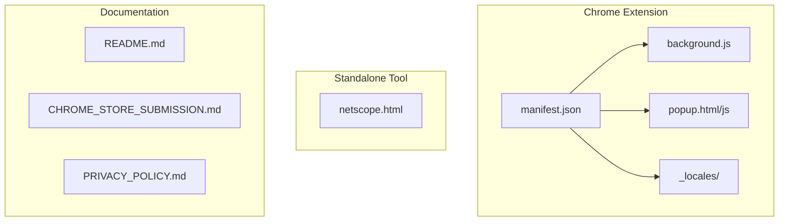
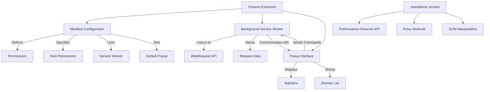
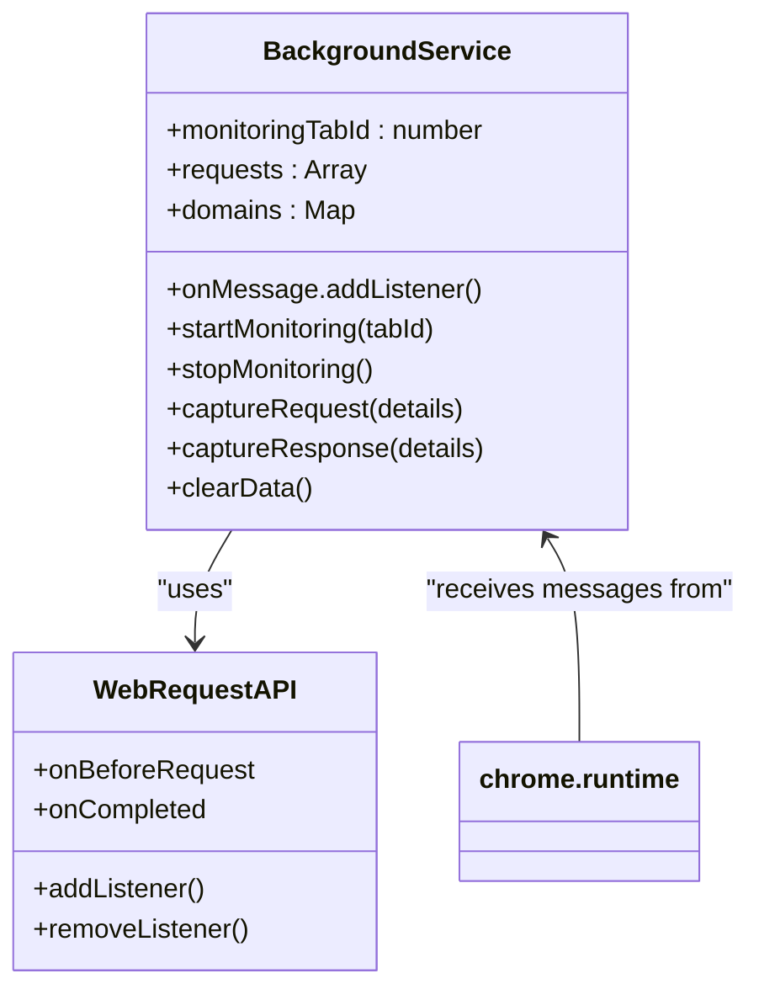
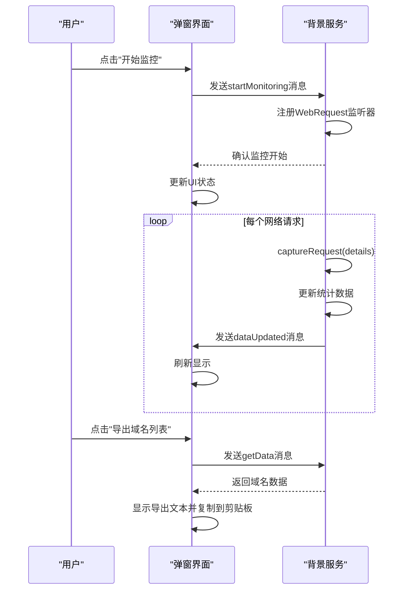
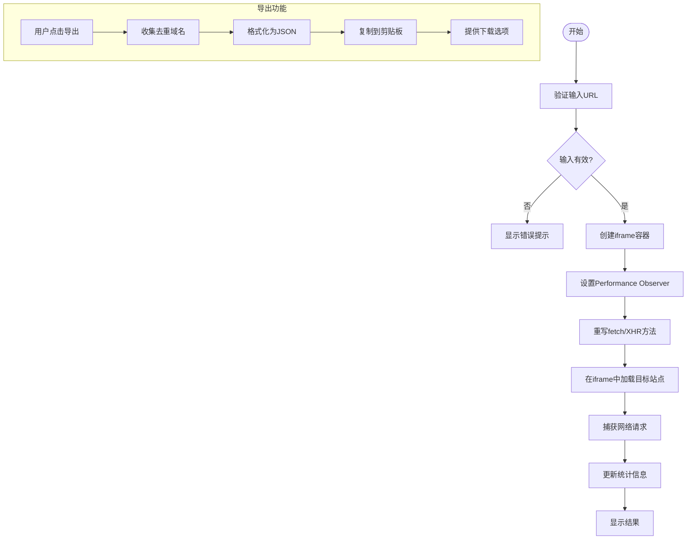

# 项目概述

<cite>
**Referenced Files in This Document **   
- [README.md](file://README.md)
- [chrome-extension/background.js](file://chrome-extension/background.js)
- [chrome-extension/popup.js](file://chrome-extension/popup.js)
- [chrome-extension/manifest.json](file://chrome-extension/manifest.json)
- [chrome-extension/popup.html](file://chrome-extension/popup.html)
- [netscope.html](file://netscope.html)
- [chrome-extension/_locales/en/messages.json](file://chrome-extension/_locales/en/messages.json)
- [chrome-extension/_locales/zh_CN/messages.json](file://chrome-extension/_locales/zh_CN/messages.json)
</cite>

## 目录
1. [简介](#简介)
2. [项目结构](#项目结构)
3. [核心功能](#核心功能)
4. [架构设计](#架构设计)
5. [组件分析](#组件分析)
6. [技术特点](#技术特点)
7. [使用指南](#使用指南)
8. [应用场景](#应用场景)
9. [结论](#结论)

## 简介

NetScope是一款强大的网络请求监控工具，旨在帮助开发者实时监控和分析网页加载过程中的所有网络请求。该项目提供Chrome扩展和独立HTML工具两种形式，满足不同场景下的使用需求。

作为一款纯前端工具，NetScope无需任何外部依赖，通过浏览器原生API实现完整的网络请求捕获、域名去重统计和数据导出功能。其主要目标是为开发者提供一个轻量级、高效的调试工具，用于性能分析、安全审计和白名单管理等场景。

该工具的核心价值在于能够自动收集并统计页面加载过程中涉及的所有第三方域名，帮助开发者快速识别潜在的性能瓶颈或安全风险。无论是进行网站优化还是构建内容安全策略（CSP），NetScope都能提供关键的数据支持。

**Section sources**
- [README.md](file://README.md#L1-L197)

## 项目结构

**Diagram sources **
- [README.md](file://README.md#L100-L115)

**Section sources**
- [README.md](file://README.md#L100-L115)

## 核心功能

### 实时网络请求监控

NetScope能够实时捕获指定网页标签页中的所有网络请求，包括资源文件、API调用和其他网络活动。通过精确的事件监听机制，确保不会遗漏任何请求。

### 域名去重与统计

工具自动对捕获的请求进行域名提取和去重处理，相同域名的不同路径请求被视为同一来源。同时提供详细的统计信息，包括总请求数、独立域名数和各域名的请求频次。

### 一键数据导出

支持将去重后的域名列表以JSON格式导出，并自动复制到系统剪贴板，方便开发者直接用于配置文件或其他用途。

### 双语界面支持

内置中英文双语支持，根据用户浏览器语言环境自动切换，也可手动选择偏好语言。

**Section sources**
- [README.md](file://README.md#L20-L45)

## 架构设计

**Diagram sources **
- [chrome-extension/manifest.json](file://chrome-extension/manifest.json#L1-L33)
- [chrome-extension/background.js](file://chrome-extension/background.js#L1-L110)
- [chrome-extension/popup.js](file://chrome-extension/popup.js#L1-L256)
- [netscope.html](file://netscope.html#L1-L808)

**Section sources**
- [README.md](file://README.md#L117-L130)

## 组件分析

### Chrome扩展架构

#### 背景服务 (background.js)

**Diagram sources **
- [chrome-extension/background.js](file://chrome-extension/background.js#L1-L110)

**Section sources**
- [chrome-extension/background.js](file://chrome-extension/background.js#L1-L110)

#### 弹窗界面 (popup.js)

**Diagram sources **
- [chrome-extension/popup.js](file://chrome-extension/popup.js#L1-L256)

**Section sources**
- [chrome-extension/popup.js](file://chrome-extension/popup.js#L1-L256)

### 独立HTML工具 (netscope.html)

**Diagram sources **
- [netscope.html](file://netscope.html#L1-L808)

**Section sources**
- [netscope.html](file://netscope.html#L1-L808)

## 技术特点

### 浏览器原生API应用

#### Chrome扩展模式
- **WebRequest API**: 提供最全面的网络请求拦截能力，不受同源策略限制
- **Storage API**: 用于持久化存储用户语言偏好设置
- **Tabs API**: 获取